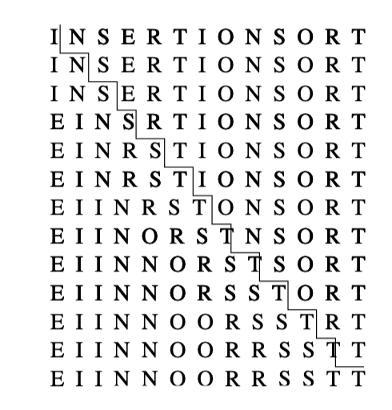
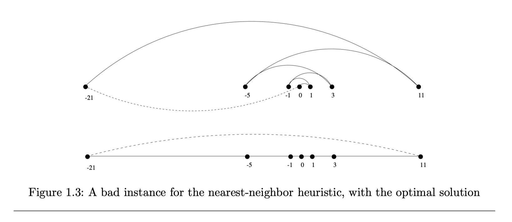

----

译者：BING

时间：20190602

----

什么是算法？算法就是完成特定任务的程序。算法就是任何合理的计算机程序背后的想法。有趣的是，算法必须要解决一类通用的，定义良好的问题。算法问题是通过描述它用到的完整的一组实例以及在这组实例上执行运算之后的输出。
问题和问题的实例之间的区别是至关重要的。比如，排序算法定义如下：

问题：排序

输入：一组键$a_1, a_2,..., a_n$

输出：重新组织的一组输入，使得$a'_1 \le a'_2 ... \le a'_{n-1} \le a'_n$

排序算法的实例可以是数组的名字，如 {Mike, Bob, Sally, Jill, Jan}，或者是一组数字，如{154, 245, 568, 324, 654, 324}。确定你要解决的问题，是解决问题的第一步。

算法是这样的程序：接收任意的输入实例，并将其转换为满足的输出。有很多不同的算法来解决排序问题。比如，插入排序法，是从一个元素开始，逐渐将剩余的元素插入到数组形成完整的有序数组。这个算法，用C语言实现如下：

```c
insertion_sort(item s[], int n) {
    int i, j; 
    for (i = 1; i < n; i++) {
        j = i;
        while ((j > 0) && (s[j] < s[j-1])) {
            swap(&s[j], &s[j-1]);
            j = j - 1;
        }
    }
}
```

这个算法的逻辑流描述如下图：



注意这个算法的广泛性。它在数值元素上同样有效，只要给定合适的比较运算符（<）来测试哪个键应当出现在前面。很容易验证，这个算法是否正确的按照定义为每个元素排了序。

一个好的算法有三个特性。我们寻求的算法既正确又高效，同时容易实现。而这三个目标可能并不能同时达到。在业界，任何程序能给出足够好的答案且不会使程序变慢都是可以接受的，而不管是否存在更好的算法。寻求最好的解法或者实现性能最大化，在业界只会在对性能有严重影响或者有法律问题时才会出现。

本章，我们将关注算法的正确性，并将效率的讨论推迟到第二章。给定的算法是否正确解决了问题有时候并非显而易见。正确的算法通常要有正确性证明，这也是我们为什么知道给定的问题输入会得到正确的结果。但是，在进一步之前，我们来展示为什么显而易见并不会满足正确性证明，而且通常还是错的。

### 1.1 机器人路径优化

我们考虑一个在工业生产，交通以及测试应用时会出现的问题。假定我们有一个机器手臂，上面装备了一个工具，比如说是个烙铁。生产电路板时，所有的芯片上都有一组连接点，需要焊接到板子上。为机械臂编程这个任务，我们首先需要构建连接点的顺序以便机器人（烙铁）访问第一个连接点，然后第二个，第三个，第四个等等直到工作完成。机械臂然后回到第一个连接点以准备为下一个板子焊接，这样我们就把工具路径变成了一个闭环。

机器人是很贵的设备，因此我们想路径最短，组建电路板的时间最小。合理的假设是机械臂的移动速度均匀，所以两个点之间的耗时与距离成正比。简单说就是，我们必须解决下面的算法问题：

问题：机器人路径优化

输入：平面上的n个点集合S

输出：在这个集合上如何访问到每个点同时路径环最小？

你的任务是为这个机械系编程。停一下想想用什么算法来解决这个问题。我很愿意等你找到一个可行算法...

有好几个算法能解决这个问题。或许最流行的想法就是**最近邻**启发式算法。从某个点`p0`出发，首先走到它的最近邻`p1`。从`p1`在走到它的最近邻且未访问的，这样就把`p0`排除在外了。现在重复这个过程，直到用完所有的未访问点，然后我们回到起始点`p0`。用伪代码写就是，启发式最近邻代码如下：

```C++
NearestNeighbor(P)
    从P中选择并访问第一个点p0
    p = p0
    i = 0
    当仍然有未访问点时
    	i = i + 1
    	选择pi，它是和pi-1最近且未访问的点
    	访问pi
    从pn-1回到p0
```

这个算法有很多推荐理由。它容易理解且易实现。访问邻居点而不是访问更远的点来减少总的访问时间是说得通的。这个算法在图1.2中使用是可以的，最近邻算法也是很高效的。因为它至多访问结点对$(p_i, p_j)$两次：一次将`$p_i$添加到路径，另一次是当添加$p_j$时。但是这些优点之外，只有一个问题，这就是：**这个算法是完全错误的。**


错了？怎么会错的呢？这个算法总能找到一个路径，但是它并不一定是最短路径。甚至都不靠近正确答案。考虑图1.3的点集，所有的点都分散在一个线上。数字描述了每个点位于标记为0的点的左侧或者右侧的距离。

从点0开始并不断向下一个最近的未访问结点走，我们可能会不停地左右左右跨过0点，算法本身并不知道如何打破这种关系。一个更好的(实际上是最优的)路径是从最左边的点开始，向右走时访问每个点，最后从最右侧的点返回到起点。



想象一下你的老板看到机械臂在组装这个简单的板子时左右左右跳动，你老板会有多"高兴"。

"但是，等等"，你可能要说，"问题在于从点0开始，但是为什么不从最左边的点开始使用最近邻算法呢？"这样做我们就能发现这个问题上的最优解了。

这是100%正确的，至少在我们将例子旋转90度之前。现在所有的点都是最左边的点了。