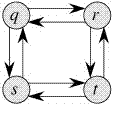

----

原文链接：https://www.geeksforgeeks.org/optimal-substructure-property-in-dynamic-programming-dp-2/

译者：BING

时间：20190602

-----

我们在前一篇文章中提到，表示一个问题能用动态规划来解的两个主要特征是：

1）重叠子问题

2）最优子结构

我们已经在上一篇文章中讨论了重叠子问题性质，现在我们来讨论最优子结构性质。

**2) 最优子结构:**当给定的问题的最优解能通过使用子问题的最优解获取时就可以说给定的问题有最优子结构。

比如，最短路径问题就有最优子结构的性质：

如果结点`x`在结点`u`到结点`v`之间，那么从结点`u`到结点`v`的最短路径就是结点`u`到结点`x`和结点`x`到结点`v`的最短路径的组合。标准的最短路径的所有路径解法比如 [Floyd–Warshall](https://www.geeksforgeeks.org/dynamic-programming-set-16-floyd-warshall-algorithm/)和 [Bellman–Ford ](https://www.geeksforgeeks.org/dynamic-programming-set-23-bellman-ford-algorithm/)就是经典的动态规划的案例。

与最短路径不同，这些最长路径没有最优子结构性质。比如，最长路径q→r→t ，并不是从`q`到`r`的最长路径和从`r`到`t`的最长路径的组合，因为`q`到`r`的最长路径是 q→s→t→r ，同时从`r`到`t`的最长路径是r→q→s→t。

我们会在将来的文章中聊更多的关于动态规划的案例。

## 推荐阅读:

- [Overlapping Subproblems Property in Dynamic Programming | DP-1](https://www.geeksforgeeks.org/overlapping-subproblems-property-in-dynamic-programming-dp-1/)
- [Optimal Binary Search Tree | DP-24](https://www.geeksforgeeks.org/optimal-binary-search-tree-dp-24/)
- [Optimal Strategy for a Game | DP-31](https://www.geeksforgeeks.org/optimal-strategy-for-a-game-dp-31/)
- [Travelling Salesman Problem | Set 1 (Naive and Dynamic Programming)](https://www.geeksforgeeks.org/travelling-salesman-problem-set-1/)
- [Vertex Cover Problem | Set 2 (Dynamic Programming Solution for Tree)](https://www.geeksforgeeks.org/vertex-cover-problem-set-2-dynamic-programming-solution-tree/)
- [Bitmasking and Dynamic Programming | Set 1 (Count ways to assign unique cap to every person)](https://www.geeksforgeeks.org/bitmasking-and-dynamic-programming-set-1-count-ways-to-assign-unique-cap-to-every-person/)
- [Compute nCr % p | Set 1 (Introduction and Dynamic Programming Solution)](https://www.geeksforgeeks.org/compute-ncr-p-set-1-introduction-and-dynamic-programming-solution/)
- [Dynamic Programming | High-effort vs. Low-effort Tasks Problem](https://www.geeksforgeeks.org/dynamic-programming-high-effort-vs-low-effort-tasks-problem/)
- [How to solve a Dynamic Programming Problem ?](https://www.geeksforgeeks.org/solve-dynamic-programming-problem/)
- [Top 20 Dynamic Programming Interview Questions](https://www.geeksforgeeks.org/top-20-dynamic-programming-interview-questions/)
- [Dynamic Programming | Building Bridges](https://www.geeksforgeeks.org/dynamic-programming-building-bridges/)
- [Bitmasking and Dynamic Programming | Set-2 (TSP)](https://www.geeksforgeeks.org/bitmasking-dynamic-programming-set-2-tsp/)
- [Distinct palindromic sub-strings of the given string using Dynamic Programming](https://www.geeksforgeeks.org/distinct-palindromic-sub-strings-of-the-given-string-using-dynamic-programming/)
- [Dynamic Programming on Trees | Set-1](https://www.geeksforgeeks.org/dynamic-programming-trees-set-1/)
- [Dynamic Programming on Trees | Set 2](https://www.geeksforgeeks.org/dynamic-programming-trees-set-2/)