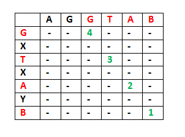

-----

原文链接：https://www.geeksforgeeks.org/longest-common-subsequence-dp-4/

时间：20190608

译者：BING

----

我们已经在前面用 [文章1](https://www.geeksforgeeks.org/dynamic-programming-set-1/)和[文章2](https://www.geeksforgeeks.org/dynamic-programming-set-2-optimal-substructure-property/)分别讨论了动态规划问题的重叠子问题和最优子结构两个性质。同时我们也在[文章3](https://www.geeksforgeeks.org/longest-increasing-subsequence/)讨论了样例问题。现在我们来讨论最长公共子序列(LCS)问题作为又一个案例，这也是可以通过动态规划来解决的问题。

LCS问题描述：给定两个序列，找到最长的序列，同时出现在两个序列中。序列的定义是，字符按照相同的相对顺序出现，而不必是连续的。如“abc”, “abg”, “bdf”, “aeg”, ‘”acefg”等都是"abcdefg"的子序列。所以长度为n的字符串有$2^n-1$个不同的子序列。

LCS是经典的计算机可学问题，也是 [diff ](http://en.wikipedia.org/wiki/Diff)(文件比较程序，输出的是两个文件的不同)函数的基础，在生物信息学领域也有广泛应用。

**例子:**

序列“ABCDGH” 和 “AEDFHR”的LCS是"ADH"，长度为3。

序列 “AGGTAB”和“GXTXAYB”是“GTAB” ，长度为4。

**推荐：在看答案之前请先解决[练习问题](https://practice.geeksforgeeks.org/problems/longest-common-subsequence/0)。**

朴素的解法是生成两个序列的所有子序列，然后去找二者共有的最长的子序列。这个解法是指数级别的时间复杂度。我们看这个问题如何体现DP的两个重要性质。

**1) 最优子结构:** 

令输入序列为`X[0...m-1]`和`Y[0...n-1]`，长度分别为`m`和`n`。并令`L(X[0...m-1], Y[0...n-1])`为两个序列X和Y的LCS的长度。下面是`L(X[0...m-1], Y[0...n-1])`的递归定义。

如果两个序列的最后字符相同(`X[m-1]==Y[n-1]`)那么

`L(X[0..m-1], Y[0..n-1]) = 1 + L(X[0..m-2], Y[0..n-2])`

如果两个序列的最后字符不相等(`X[m-1]！=Y[n-1]`)那么

`L(X[0..m-1], Y[0..n-1]) = MAX(L(X[0..m-2], Y[0..n-1]), L(X[0..m-1], Y[0..n-2]))`

例子:
1) 考虑输入字符串"AGGTAB"和"GXTXAYB"。最后一个字符相同，所以LCS的长度可以写为：
`L("AGGTAB", "GXTXAYB") = 1 + L("AGGTA", "GXTXAY")`。



2) 考虑输入字符串"ABCDGH"和"AEDFHR"。最后字符不相等，所以LCS可以写成：
`L("ABCDGH", "AEDFHR") = MAX(L("ABCDG", "AEDFHR"), L("ABCDGH", "AEDFH))`

所以LCS问题具有最优子结构性质，因为主要的问题可以通过求解子问题得到求解。

**2) 重叠子问题:**

下面是简单的递归版本的LCS问题的实现。这个实现简单的遵循了上面提到的递归结构。

```c
/* A Naive recursive implementation of LCS problem */
#include<bits/stdc++.h> 
int max(int a, int b); 

/* Returns length of LCS for X[0..m-1], Y[0..n-1] */
int lcs( char *X, char *Y, int m, int n ) { 
    if (m == 0 || n == 0) 
        return 0; 
    if (X[m-1] == Y[n-1]) 
        return 1 + lcs(X, Y, m-1, n-1); 
    else
        return max(lcs(X, Y, m, n-1), lcs(X, Y, m-1, n)); 
} 

/* Utility function to get max of 2 integers */
int max(int a, int b) { 
	return (a > b)? a : b; 
} 

/* Driver program to test above function */
int main() { 
    char X[] = "AGGTAB"; 
    char Y[] = "GXTXAYB"; 

    int m = strlen(X); 
    int n = strlen(Y); 
    
    printf("Length of LCS is %d", lcs( X, Y, m, n ) ); 
    return 0; 
} 
```

**输出**:

```bash
Length of LCS is 4
```

上面的朴素递归实现的时间复杂度在最差情况下是$O(2^n)$，这个情况是X和Y的所有字符串都不相同，也就是LCS为0。

思考上面的实现，下面是字符串"AXYT"和"AYZX"的部分递归树：

```pre
                lcs("AXYT", "AYZX")
                       /                 
         lcs("AXY", "AYZX")            lcs("AXYT", "AYZ")
         /                              /               
lcs("AX", "AYZX") lcs("AXY", "AYZ")   lcs("AXY", "AYZ") lcs("AXYT", "AY")
```

在上面部分递归树里，`lcs("AXY", "AYZ")`被求解了两次。如果我们画出完整的递归树，我们可以看到有很多子问题会被求解多次。因此这个问题均有重叠子结构性质，同样的子问题被计算了多次，我们可以用记忆化或者表格来避免这种重复计算。下面是表格化的实现LCS问题解法。

```c
/* Dynamic Programming C/C++ implementation of LCS problem */
#include<bits/stdc++.h> 

int max(int a, int b); 

/* Returns length of LCS for X[0..m-1], Y[0..n-1] */
int lcs( char *X, char *Y, int m, int n ) { 
    int L[m+1][n+1]; 
    int i, j; 

    /* Following steps build L[m+1][n+1] in bottom up fashion. Note 
        that L[i][j] contains length of LCS of X[0..i-1] and Y[0..j-1] */
    for (i = 0; i <= m; i++) { 
        for (j = 0; j <= n; j++) { 
        if (i == 0 || j == 0) 
            L[i][j] = 0; 

        else if (X[i-1] == Y[j-1]) 
            L[i][j] = L[i-1][j-1] + 1; 

        else
            L[i][j] = max(L[i-1][j], L[i][j-1]); 
        } 
	} 
    /* L[m][n] contains length of LCS for X[0..n-1] and Y[0..m-1] */
    return L[m][n]; 
} 

/* Utility function to get max of 2 integers */
int max(int a, int b) 
{ 
	return (a > b)? a : b; 
} 

/* Driver program to test above function */
int main() { 
    char X[] = "AGGTAB"; 
    char Y[] = "GXTXAYB"; 

    int m = strlen(X); 
    int n = strlen(Y); 

    printf("Length of LCS is %d", lcs( X, Y, m, n ) ); 

    return 0; 
} 
```

**输出**:

```bash
Length of LCS is 4
```

上面这种实现的时间复杂度是$O(mn)$，比朴素递归实现版本的最差时间要好很多。

上面的算法/代码只返回LCS的长度，请看下面这篇文章了解：

[如何打印出最长公共子序列](https://www.geeksforgeeks.org/printing-longest-common-subsequence/)。

也可以看下面这篇文章了解如何优化空间版本的LCS：

[空间优化的LCS](https://www.geeksforgeeks.org/space-optimized-solution-lcs/)

PS. 学习如何一步一步优化算法比学习更多算法要更重要，这是一种持续优化的思维方式。

END.