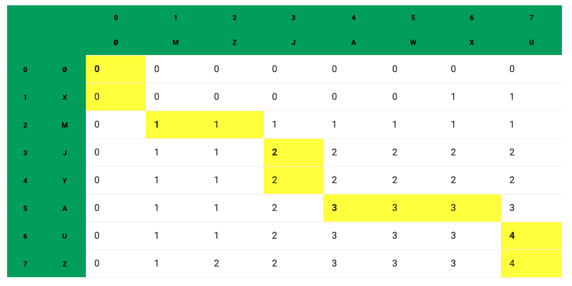

-----

时间：20190608

译者：BING

原文链接：https://www.geeksforgeeks.org/printing-longest-common-subsequence/

----

给定两个序列，打印同时出现在两个序列中的最长在子序列。

**例子:**

序列“ABCDGH” 和 “AEDFHR”的LCS是"ADH"，长度为3。

序列 “AGGTAB”和“GXTXAYB”是“GTAB” ，长度为4。

我们已经在上一篇文章中讨论了LCS问题。讨论的函数主要是为了找到LCS的长度。为了发现LCS的长度，需要构建一个二维的表。在本篇中，要讨论的函数是构建并打印出LCS。

下面是打印LCS的算法细节，它使用同样的二维表格L。

**1)** 构建一个表格`L[m+1][n+1]`，用[上一篇文章](https://github.com/nrqzdhlsc/Pytorch/blob/master/Leetcode/tutorials/LCS-最长公共子序列.md)的步骤。

**2)** `L[m][n]`包含LCS的长度，创建一个字符数组`lcs[]`长度等于`lcs + 1`(额外的是存储`\0`)

**3)** 从`L[m][n]`开始遍历二维数组，按照下面的步骤遍历每个表格块`L[i][j]`

...a) 如果`L[i][j]`对应的字符相同(`X[i-1]==Y[j-1]`)，那么将这个字符包含在LCS中

...b) 否则比较`L[i-1][j]`和`L[i][j-1]`，向更大的值的方向继续



```c
/* Dynamic Programming implementation of LCS problem */
#include<iostream> 
#include<cstring> 
#include<cstdlib> 
using namespace std; 

/* Returns length of LCS for X[0..m-1], Y[0..n-1] */
void lcs( char *X, char *Y, int m, int n ) 
{ 
    int L[m+1][n+1]; 

    /* Following steps build L[m+1][n+1] in bottom up fashion. Note 
        that L[i][j] contains length of LCS of X[0..i-1] and Y[0..j-1] */
    for (int i = 0; i <= m; i++) 
    { 
        for (int j = 0; j <= n; j++) 
        { 
        if (i == 0 || j == 0) 
            L[i][j] = 0; 
        else if (X[i-1] == Y[j-1]) 
            L[i][j] = L[i-1][j-1] + 1; 
        else
            L[i][j] = max(L[i-1][j], L[i][j-1]); 
        } 
	} 

    // 下面的代码用于打印出LCS
    int index = L[m][n]; 

    // Create a character array to store the lcs string 
    char lcs[index+1]; 
    lcs[index] = ''; // Set the terminating character 

    // Start from the right-most-bottom-most corner and 
    // one by one store characters in lcs[] 
    int i = m, j = n; 
    while (i > 0 && j > 0) 
    { 
        // If current character in X[] and Y are same, then 
        // current character is part of LCS 
        if (X[i-1] == Y[j-1]) 
        { 
            lcs[index-1] = X[i-1]; // Put current character in result 
            i--; j--; index--;	 // reduce values of i, j and index 
        } 

        // If not same, then find the larger of two and 
        // go in the direction of larger value 
        else if (L[i-1][j] > L[i][j-1]) 
            i--; 
        else
            j--; 
    } 

    // Print the lcs 
    cout << "LCS of " << X << " and " << Y << " is " << lcs; 
} 

/* Driver program to test above function */
int main() 
{ 
    char X[] = "AGGTAB"; 
    char Y[] = "GXTXAYB"; 
    int m = strlen(X); 
    int n = strlen(Y); 
    lcs(X, Y, m, n); 
    return 0; 
} 
```

输出:

```
LCS of AGGTAB and GXTXAYB is GTAB
```

END.