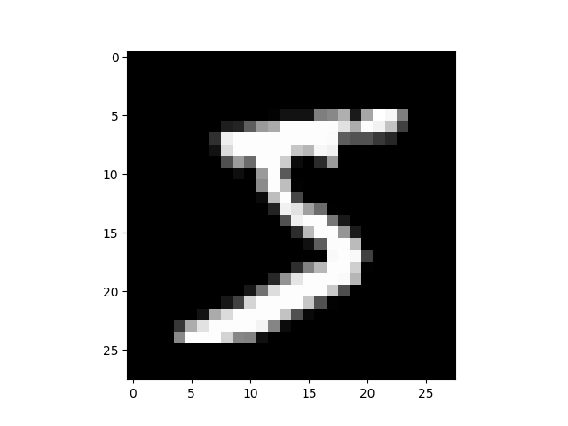

----

原文链接：https://pytorch.org/tutorials/beginner/nn_tutorial.html

译者：BING

时间：20190604

----

作者： Jeremy Howard, [fast.ai](https://www.fast.ai/)。感谢Rachel Thomas和Francisco Ingham。

我们推荐以notebook的形式运行本教程，而不是脚本。点击图标下载`.ipynb`文件。

PyTorch提供了设计优雅的模块和类，如`torch.nn`，`torch.optim`，`Dataset`以及`DataLoader`帮助你创建和训练神经网络。为了完全用上它们的能力并针对你的问题来定制，你需要真的理解它们是干什么的。为了深化你的理解，我们首先训练一个基础的神经网络，使用MNIST数据集，不用这些模块的任何特性。我们只用最基础的PyTorch张量功能来完成。然后我们增加一些特性，一次从`torch.nn`,`torch.optim`,`Dataset`以及`DataLoader`中选择一个特性，这样就能展示每一部分到底干啥了，以及它是如何工作的，知道这些就可以编写更精炼或者更灵活的代码。

本教程假定你已经安装了PyTorch，并熟悉张量的基础操作。如果你熟悉Numpy数组操作，你会发现PyTorch张量操作几乎是一样的。

## MNIST数据设置

我们用经典的 [MNIST](http://deeplearning.net/data/mnist/) 数据集，这些包含手写数字（0~9）的黑白图片。

我们用[pathlib](https://docs.python.org/3/library/pathlib.html)来处理路径相关的内容，这是Python3的标准库，并且通过使用`requests`库来下载数据集。我们只在使用到的时候再导入模块，所以你可以每个点上是如何使用的。

```python
from pathlib import Path
import requests

DATA_PATH = Path("data")
PATH = DATA_PATH / "mnist" # data/mnist

PATH.mkdir(parents=True, exist_ok=True)

URL = "http://deeplearning.net/data/mnist/"
FILENAME = "mnist.pkl.gz"

if not (PATH / FILENAME).exists():
        content = requests.get(URL + FILENAME).content
        (PATH / FILENAME).open("wb").write(content)
```

数据集是以Numpy数组的格式，并且使用Pickle来存储，这是Python特有的序列化数据的格式。

```python
import pickle
import gzip

with gzip.open((PATH / FILENAME).as_posix(), "rb") as f:
        ((x_train, y_train), (x_valid, y_valid), _) = pickle.load(f, encoding="latin-1")
```

每个图片是28x28大小，并且展开为长度为784的行向量。我们先看一个，我们需要将数据转换为2维数组先。

```python
from matplotlib import pyplot
import numpy as np

pyplot.imshow(x_train[0].reshape((28, 28)), cmap="gray")
print(x_train.shape)
```



输出:

```
(50000, 784)
```

PyTorch用的是 `torch.tensor`，而不是Numpy数组，因此我们需要转换数据。 

```python
import torch

x_train, y_train, x_valid, y_valid = map(
    torch.tensor, (x_train, y_train, x_valid, y_valid)
)
n, c = x_train.shape
x_train, x_train.shape, y_train.min(), y_train.max()
print(x_train, y_train)
print(x_train.shape)
print(y_train.min(), y_train.max())
```

输出:

```bash
tensor([[0., 0., 0.,  ..., 0., 0., 0.],
        [0., 0., 0.,  ..., 0., 0., 0.],
        [0., 0., 0.,  ..., 0., 0., 0.],
        ...,
        [0., 0., 0.,  ..., 0., 0., 0.],
        [0., 0., 0.,  ..., 0., 0., 0.],
        [0., 0., 0.,  ..., 0., 0., 0.]]) tensor([5, 0, 4,  ..., 8, 4, 8])
torch.Size([50000, 784])
tensor(0) tensor(9)
```

## 从头开始写神经网络 (不用torch.nn)

我们先只用PyTorch的张量操作来创建一个模型。我们假设你已经熟悉了神经网络基础。

PyTorch提供了创建随机数和用0填充的张量，对于简单的线性模型我们会用来创建权重和偏置。这些是正常的张量，但是会带上一个**特殊的操作**：告诉PyTorch它们需要梯度。这是导致PyTorch记录对张量的所有操作，因此，在反向传播期间能自动计算梯度。

针对权重，我们在初始化之后设置`requires_grad`，因为我们不需要这步包含在梯度中。

我们使用 [Xavier初始化](http://proceedings.mlr.press/v9/glorot10a/glorot10a.pdf) (乘以1 / sqrt(n)) 。

```python
import math

weights = torch.randn(784, 10) / math.sqrt(784)
weights.requires_grad_()
bias = torch.zeros(10, requires_grad=True)
```

感谢PyTorch提供的**自动计算梯度**的能力，我们能用标准的Python函数(或者可调用的对象)作为模型。因此我们就写一个朴素的矩阵乘法和广播的加法来创建一个简单的线性模型。我们也需要一个激活函数，因此我们写个`log_softmax`并使用它。记住，虽然PyTorch提供了很多预先写好的损失函数，激活函数等，使用原生的Python能很容易写出自己的损失函数。PyTorch甚至可以自动创建快速的GPU化的代码或者向量化的CPU代码。

```python
def log_softmax(x):
    return x - x.exp().sum(-1).log().unsqueeze(-1)

def model(xb):
    return log_softmax(xb @ weights + bias)
```

上面`@`表示点乘操作。我们将在一批数据上调用函数(本例中，64张图片)。这是一次前向过程。注意，现在我们的预测不会比瞎猜要好，因为我们从随机的权重开始。

```python
bs = 64  # batch size

xb = x_train[0:bs]  # a mini-batch from x
preds = model(xb)  # predictions
preds[0], preds.shape
print(preds[0], preds.shape)
```

输出:

```
tensor([-2.1101, -2.3097, -2.1495, -2.8076, -2.1427, -2.4339, -2.2858, -3.0636,
        -2.2182, -1.9637], grad_fn=<SelectBackward>) torch.Size([64, 10])
```

可以看到`preds`张量不仅包含张量的值，还有一个梯度函数，我们将用这个函数在后面做反向传播。

现在我们来实现一个负log似然函数用作损失函数(再次说明，我们可以只用标准的Python)：

```python
def nll(input, target): # 这里的input是变量名，不是保留关键字的含义
    return -input[range(target.shape[0]), target].mean()

loss_func = nll
```

先在随机模型上检查损失函数，然后再看我们是否通过反向传播提升了模型。

```python
yb = y_train[0:bs]
print(loss_func(preds, yb))
```

输出:

```
tensor(2.4133, grad_fn=<NegBackward>)
```

我们同事也实现一个函数用来计算模型的精度。每个预测，如果最大值的下标和目标值匹配，则预测正确。

```python
def accuracy(out, yb):
    preds = torch.argmax(out, dim=1)
    return (preds == yb).float().mean()
```

先检查随机模型的精度，以确认随着损失降低精度是否提升。

```python
print(accuracy(preds, yb))
```

输出:

```bash
tensor(0.0781)
```

现在我们可以运行训练过程，每次迭代，我们将：

- 选择一个mini批次的数据(大小为`bs`)
- 使用模型进行预测
- 计算损失
- `loss.backward()` 更新模型梯度，本例中是`weights`和`bias`

现在我们用这些梯度来更新权重和偏置。我们在`torch.no_grad()` 语境管理下，因为我们不希望这些操作被记录，影响到下一次计算梯度。可以读[这篇](https://pytorch.org/docs/stable/notes/autograd.html).来了解更多PyTorch自动梯度是如何记录操作的。

We then set the gradients to zero, so that we are ready for the next loop. Otherwise, our gradients would record a running tally of all the operations that had happened (i.e. `loss.backward()` *adds* the gradients to whatever is already stored, rather than replacing them).

TIP

You can use the standard python debugger to step through PyTorch code, allowing you to check the various variable values at each step. Uncomment `set_trace()` below to try it out.

```
from IPython.core.debugger import set_trace

lr = 0.5  # learning rate
epochs = 2  # how many epochs to train for

for epoch in range(epochs):
    for i in range((n - 1) // bs + 1):
        #         set_trace()
        start_i = i * bs
        end_i = start_i + bs
        xb = x_train[start_i:end_i]
        yb = y_train[start_i:end_i]
        pred = model(xb)
        loss = loss_func(pred, yb)

        loss.backward()
        with torch.no_grad():
            weights -= weights.grad * lr
            bias -= bias.grad * lr
            weights.grad.zero_()
            bias.grad.zero_()
```

That’s it: we’ve created and trained a minimal neural network (in this case, a logistic regression, since we have no hidden layers) entirely from scratch!

Let’s check the loss and accuracy and compare those to what we got earlier. We expect that the loss will have decreased and accuracy to have increased, and they have.

```
print(loss_func(model(xb), yb), accuracy(model(xb), yb))
```

Out:

```
tensor(0.0814, grad_fn=<NegBackward>) tensor(1.)
```

## Using torch.nn.functional

We will now refactor our code, so that it does the same thing as before, only we’ll start taking advantage of PyTorch’s `nn` classes to make it more concise and flexible. At each step from here, we should be making our code one or more of: shorter, more understandable, and/or more flexible.

The first and easiest step is to make our code shorter by replacing our hand-written activation and loss functions with those from `torch.nn.functional` (which is generally imported into the namespace `F` by convention). This module contains all the functions in the `torch.nn` library (whereas other parts of the library contain classes). As well as a wide range of loss and activation functions, you’ll also find here some convenient functions for creating neural nets, such as pooling functions. (There are also functions for doing convolutions, linear layers, etc, but as we’ll see, these are usually better handled using other parts of the library.)

If you’re using negative log likelihood loss and log softmax activation, then Pytorch provides a single function `F.cross_entropy`that combines the two. So we can even remove the activation function from our model.

```
import torch.nn.functional as F

loss_func = F.cross_entropy

def model(xb):
    return xb @ weights + bias
```

Note that we no longer call `log_softmax` in the `model` function. Let’s confirm that our loss and accuracy are the same as before:

```
print(loss_func(model(xb), yb), accuracy(model(xb), yb))
```

Out:

```
tensor(0.0814, grad_fn=<NllLossBackward>) tensor(1.)
```

## Refactor using nn.Module

Next up, we’ll use `nn.Module` and `nn.Parameter`, for a clearer and more concise training loop. We subclass `nn.Module` (which itself is a class and able to keep track of state). In this case, we want to create a class that holds our weights, bias, and method for the forward step. `nn.Module` has a number of attributes and methods (such as `.parameters()` and `.zero_grad()`) which we will be using.

NOTE

`nn.Module` (uppercase M) is a PyTorch specific concept, and is a class we’ll be using a lot. `nn.Module` is not to be confused with the Python concept of a (lowercase `m`) [module](https://docs.python.org/3/tutorial/modules.html), which is a file of Python code that can be imported.

```
from torch import nn

class Mnist_Logistic(nn.Module):
    def __init__(self):
        super().__init__()
        self.weights = nn.Parameter(torch.randn(784, 10) / math.sqrt(784))
        self.bias = nn.Parameter(torch.zeros(10))

    def forward(self, xb):
        return xb @ self.weights + self.bias
```

Since we’re now using an object instead of just using a function, we first have to instantiate our model:

```
model = Mnist_Logistic()
```

Now we can calculate the loss in the same way as before. Note that `nn.Module` objects are used as if they are functions (i.e they are *callable*), but behind the scenes Pytorch will call our `forward` method automatically.

```
print(loss_func(model(xb), yb))
```

Out:

```
tensor(2.4449, grad_fn=<NllLossBackward>)
```

Previously for our training loop we had to update the values for each parameter by name, and manually zero out the grads for each parameter separately, like this:

```
with torch.no_grad():
    weights -= weights.grad * lr
    bias -= bias.grad * lr
    weights.grad.zero_()
    bias.grad.zero_()
```

Now we can take advantage of model.parameters() and model.zero_grad() (which are both defined by PyTorch for `nn.Module`) to make those steps more concise and less prone to the error of forgetting some of our parameters, particularly if we had a more complicated model:

```
with torch.no_grad():
    for p in model.parameters(): p -= p.grad * lr
    model.zero_grad()
```

We’ll wrap our little training loop in a `fit` function so we can run it again later.

```
def fit():
    for epoch in range(epochs):
        for i in range((n - 1) // bs + 1):
            start_i = i * bs
            end_i = start_i + bs
            xb = x_train[start_i:end_i]
            yb = y_train[start_i:end_i]
            pred = model(xb)
            loss = loss_func(pred, yb)

            loss.backward()
            with torch.no_grad():
                for p in model.parameters():
                    p -= p.grad * lr
                model.zero_grad()

fit()
```

Let’s double-check that our loss has gone down:

```
print(loss_func(model(xb), yb))
```

Out:

```
tensor(0.0817, grad_fn=<NllLossBackward>)
```

## Refactor using nn.Linear

We continue to refactor our code. Instead of manually defining and initializing `self.weights` and `self.bias`, and calculating `xb @ self.weights + self.bias`, we will instead use the Pytorch class [nn.Linear](https://pytorch.org/docs/stable/nn.html#linear-layers) for a linear layer, which does all that for us. Pytorch has many types of predefined layers that can greatly simplify our code, and often makes it faster too.

```
class Mnist_Logistic(nn.Module):
    def __init__(self):
        super().__init__()
        self.lin = nn.Linear(784, 10)

    def forward(self, xb):
        return self.lin(xb)
```

We instantiate our model and calculate the loss in the same way as before:

```
model = Mnist_Logistic()
print(loss_func(model(xb), yb))
```

Out:

```
tensor(2.2903, grad_fn=<NllLossBackward>)
```

We are still able to use our same `fit` method as before.

```
fit()

print(loss_func(model(xb), yb))
```

Out:

```
tensor(0.0812, grad_fn=<NllLossBackward>)
```

## Refactor using optim

Pytorch also has a package with various optimization algorithms, `torch.optim`. We can use the `step` method from our optimizer to take a forward step, instead of manually updating each parameter.

This will let us replace our previous manually coded optimization step:

```
with torch.no_grad():
    for p in model.parameters(): p -= p.grad * lr
    model.zero_grad()
```

and instead use just:

```
opt.step()
opt.zero_grad()
```

(`optim.zero_grad()` resets the gradient to 0 and we need to call it before computing the gradient for the next minibatch.)

```
from torch import optim
```

We’ll define a little function to create our model and optimizer so we can reuse it in the future.

```
def get_model():
    model = Mnist_Logistic()
    return model, optim.SGD(model.parameters(), lr=lr)

model, opt = get_model()
print(loss_func(model(xb), yb))

for epoch in range(epochs):
    for i in range((n - 1) // bs + 1):
        start_i = i * bs
        end_i = start_i + bs
        xb = x_train[start_i:end_i]
        yb = y_train[start_i:end_i]
        pred = model(xb)
        loss = loss_func(pred, yb)

        loss.backward()
        opt.step()
        opt.zero_grad()

print(loss_func(model(xb), yb))
```

Out:

```
tensor(2.3222, grad_fn=<NllLossBackward>)
tensor(0.0828, grad_fn=<NllLossBackward>)
```

## Refactor using Dataset

PyTorch has an abstract Dataset class. A Dataset can be anything that has a `__len__` function (called by Python’s standard `len`function) and a `__getitem__` function as a way of indexing into it. [This tutorial](https://pytorch.org/tutorials/beginner/data_loading_tutorial.html) walks through a nice example of creating a custom `FacialLandmarkDataset` class as a subclass of `Dataset`.

PyTorch’s [TensorDataset](https://pytorch.org/docs/stable/_modules/torch/utils/data/dataset.html#TensorDataset) is a Dataset wrapping tensors. By defining a length and way of indexing, this also gives us a way to iterate, index, and slice along the first dimension of a tensor. This will make it easier to access both the independent and dependent variables in the same line as we train.

```
from torch.utils.data import TensorDataset
```

Both `x_train` and `y_train` can be combined in a single `TensorDataset`, which will be easier to iterate over and slice.

```
train_ds = TensorDataset(x_train, y_train)
```

Previously, we had to iterate through minibatches of x and y values separately:

```
xb = x_train[start_i:end_i]
yb = y_train[start_i:end_i]
```

Now, we can do these two steps together:

```
xb,yb = train_ds[i*bs : i*bs+bs]
model, opt = get_model()

for epoch in range(epochs):
    for i in range((n - 1) // bs + 1):
        xb, yb = train_ds[i * bs: i * bs + bs]
        pred = model(xb)
        loss = loss_func(pred, yb)

        loss.backward()
        opt.step()
        opt.zero_grad()

print(loss_func(model(xb), yb))
```

Out:

```
tensor(0.0807, grad_fn=<NllLossBackward>)
```

## Refactor using DataLoader

Pytorch’s `DataLoader` is responsible for managing batches. You can create a `DataLoader` from any `Dataset`. `DataLoader` makes it easier to iterate over batches. Rather than having to use `train_ds[i*bs : i*bs+bs]`, the DataLoader gives us each minibatch automatically.

```
from torch.utils.data import DataLoader

train_ds = TensorDataset(x_train, y_train)
train_dl = DataLoader(train_ds, batch_size=bs)
```

Previously, our loop iterated over batches (xb, yb) like this:

```
for i in range((n-1)//bs + 1):
    xb,yb = train_ds[i*bs : i*bs+bs]
    pred = model(xb)
```

Now, our loop is much cleaner, as (xb, yb) are loaded automatically from the data loader:

```
for xb,yb in train_dl:
    pred = model(xb)
model, opt = get_model()

for epoch in range(epochs):
    for xb, yb in train_dl:
        pred = model(xb)
        loss = loss_func(pred, yb)

        loss.backward()
        opt.step()
        opt.zero_grad()

print(loss_func(model(xb), yb))
```

Out:

```
tensor(0.0821, grad_fn=<NllLossBackward>)
```

Thanks to Pytorch’s `nn.Module`, `nn.Parameter`, `Dataset`, and `DataLoader`, our training loop is now dramatically smaller and easier to understand. Let’s now try to add the basic features necessary to create effecive models in practice.

## Add validation

In section 1, we were just trying to get a reasonable training loop set up for use on our training data. In reality, you **always** should also have a [validation set](https://www.fast.ai/2017/11/13/validation-sets/), in order to identify if you are overfitting.

Shuffling the training data is [important](https://www.quora.com/Does-the-order-of-training-data-matter-when-training-neural-networks) to prevent correlation between batches and overfitting. On the other hand, the validation loss will be identical whether we shuffle the validation set or not. Since shuffling takes extra time, it makes no sense to shuffle the validation data.

We’ll use a batch size for the validation set that is twice as large as that for the training set. This is because the validation set does not need backpropagation and thus takes less memory (it doesn’t need to store the gradients). We take advantage of this to use a larger batch size and compute the loss more quickly.

```
train_ds = TensorDataset(x_train, y_train)
train_dl = DataLoader(train_ds, batch_size=bs, shuffle=True)

valid_ds = TensorDataset(x_valid, y_valid)
valid_dl = DataLoader(valid_ds, batch_size=bs * 2)
```

We will calculate and print the validation loss at the end of each epoch.

(Note that we always call `model.train()` before training, and `model.eval()` before inference, because these are used by layers such as `nn.BatchNorm2d` and `nn.Dropout` to ensure appropriate behaviour for these different phases.)

```
model, opt = get_model()

for epoch in range(epochs):
    model.train()
    for xb, yb in train_dl:
        pred = model(xb)
        loss = loss_func(pred, yb)

        loss.backward()
        opt.step()
        opt.zero_grad()

    model.eval()
    with torch.no_grad():
        valid_loss = sum(loss_func(model(xb), yb) for xb, yb in valid_dl)

    print(epoch, valid_loss / len(valid_dl))
```

Out:

```
0 tensor(0.2909)
1 tensor(0.3357)
```

## Create fit() and get_data()

We’ll now do a little refactoring of our own. Since we go through a similar process twice of calculating the loss for both the training set and the validation set, let’s make that into its own function, `loss_batch`, which computes the loss for one batch.

We pass an optimizer in for the training set, and use it to perform backprop. For the validation set, we don’t pass an optimizer, so the method doesn’t perform backprop.

```
def loss_batch(model, loss_func, xb, yb, opt=None):
    loss = loss_func(model(xb), yb)

    if opt is not None:
        loss.backward()
        opt.step()
        opt.zero_grad()

    return loss.item(), len(xb)
```

`fit` runs the necessary operations to train our model and compute the training and validation losses for each epoch.

```
import numpy as np

def fit(epochs, model, loss_func, opt, train_dl, valid_dl):
    for epoch in range(epochs):
        model.train()
        for xb, yb in train_dl:
            loss_batch(model, loss_func, xb, yb, opt)

        model.eval()
        with torch.no_grad():
            losses, nums = zip(
                *[loss_batch(model, loss_func, xb, yb) for xb, yb in valid_dl]
            )
        val_loss = np.sum(np.multiply(losses, nums)) / np.sum(nums)

        print(epoch, val_loss)
```

`get_data` returns dataloaders for the training and validation sets.

```
def get_data(train_ds, valid_ds, bs):
    return (
        DataLoader(train_ds, batch_size=bs, shuffle=True),
        DataLoader(valid_ds, batch_size=bs * 2),
    )
```

Now, our whole process of obtaining the data loaders and fitting the model can be run in 3 lines of code:

```
train_dl, valid_dl = get_data(train_ds, valid_ds, bs)
model, opt = get_model()
fit(epochs, model, loss_func, opt, train_dl, valid_dl)
```

Out:

```
0 0.3047212772369385
1 0.3269388014793396
```

You can use these basic 3 lines of code to train a wide variety of models. Let’s see if we can use them to train a convolutional neural network (CNN)!

## Switch to CNN

We are now going to build our neural network with three convolutional layers. Because none of the functions in the previous section assume anything about the model form, we’ll be able to use them to train a CNN without any modification.

We will use Pytorch’s predefined [Conv2d](https://pytorch.org/docs/stable/nn.html#torch.nn.Conv2d) class as our convolutional layer. We define a CNN with 3 convolutional layers. Each convolution is followed by a ReLU. At the end, we perform an average pooling. (Note that `view` is PyTorch’s version of numpy’s`reshape`)

```
class Mnist_CNN(nn.Module):
    def __init__(self):
        super().__init__()
        self.conv1 = nn.Conv2d(1, 16, kernel_size=3, stride=2, padding=1)
        self.conv2 = nn.Conv2d(16, 16, kernel_size=3, stride=2, padding=1)
        self.conv3 = nn.Conv2d(16, 10, kernel_size=3, stride=2, padding=1)

    def forward(self, xb):
        xb = xb.view(-1, 1, 28, 28)
        xb = F.relu(self.conv1(xb))
        xb = F.relu(self.conv2(xb))
        xb = F.relu(self.conv3(xb))
        xb = F.avg_pool2d(xb, 4)
        return xb.view(-1, xb.size(1))

lr = 0.1
```

[Momentum](https://cs231n.github.io/neural-networks-3/#sgd) is a variation on stochastic gradient descent that takes previous updates into account as well and generally leads to faster training.

```
model = Mnist_CNN()
opt = optim.SGD(model.parameters(), lr=lr, momentum=0.9)

fit(epochs, model, loss_func, opt, train_dl, valid_dl)
```

Out:

```
0 0.3199250617980957
1 0.34418265256881714
```

## nn.Sequential

`torch.nn` has another handy class we can use to simply our code: [Sequential](https://pytorch.org/docs/stable/nn.html#torch.nn.Sequential) . A `Sequential` object runs each of the modules contained within it, in a sequential manner. This is a simpler way of writing our neural network.

To take advantage of this, we need to be able to easily define a **custom layer** from a given function. For instance, PyTorch doesn’t have a view layer, and we need to create one for our network. `Lambda` will create a layer that we can then use when defining a network with `Sequential`.

```
class Lambda(nn.Module):
    def __init__(self, func):
        super().__init__()
        self.func = func

    def forward(self, x):
        return self.func(x)


def preprocess(x):
    return x.view(-1, 1, 28, 28)
```

The model created with `Sequential` is simply:

```
model = nn.Sequential(
    Lambda(preprocess),
    nn.Conv2d(1, 16, kernel_size=3, stride=2, padding=1),
    nn.ReLU(),
    nn.Conv2d(16, 16, kernel_size=3, stride=2, padding=1),
    nn.ReLU(),
    nn.Conv2d(16, 10, kernel_size=3, stride=2, padding=1),
    nn.ReLU(),
    nn.AvgPool2d(4),
    Lambda(lambda x: x.view(x.size(0), -1)),
)

opt = optim.SGD(model.parameters(), lr=lr, momentum=0.9)

fit(epochs, model, loss_func, opt, train_dl, valid_dl)
```

Out:

```
0 0.3145593278884888
1 0.31047122631073
```

## Wrapping DataLoader

- Our CNN is fairly concise, but it only works with MNIST, because:

    It assumes the input is a 28*28 long vectorIt assumes that the final CNN grid size is 4*4 (since that’s the average

pooling kernel size we used)

Let’s get rid of these two assumptions, so our model works with any 2d single channel image. First, we can remove the initial Lambda layer but moving the data preprocessing into a generator:

```
def preprocess(x, y):
    return x.view(-1, 1, 28, 28), y


class WrappedDataLoader:
    def __init__(self, dl, func):
        self.dl = dl
        self.func = func

    def __len__(self):
        return len(self.dl)

    def __iter__(self):
        batches = iter(self.dl)
        for b in batches:
            yield (self.func(*b))

train_dl, valid_dl = get_data(train_ds, valid_ds, bs)
train_dl = WrappedDataLoader(train_dl, preprocess)
valid_dl = WrappedDataLoader(valid_dl, preprocess)
```

Next, we can replace `nn.AvgPool2d` with `nn.AdaptiveAvgPool2d`, which allows us to define the size of the *output* tensor we want, rather than the *input* tensor we have. As a result, our model will work with any size input.

```
model = nn.Sequential(
    nn.Conv2d(1, 16, kernel_size=3, stride=2, padding=1),
    nn.ReLU(),
    nn.Conv2d(16, 16, kernel_size=3, stride=2, padding=1),
    nn.ReLU(),
    nn.Conv2d(16, 10, kernel_size=3, stride=2, padding=1),
    nn.ReLU(),
    nn.AdaptiveAvgPool2d(1),
    Lambda(lambda x: x.view(x.size(0), -1)),
)

opt = optim.SGD(model.parameters(), lr=lr, momentum=0.9)
```

Let’s try it out:

```
fit(epochs, model, loss_func, opt, train_dl, valid_dl)
```

Out:

```
0 0.3216142476081848
1 0.23814181461334227
```

## Using your GPU

If you’re lucky enough to have access to a CUDA-capable GPU (you can rent one for about $0.50/hour from most cloud providers) you can use it to speed up your code. First check that your GPU is working in Pytorch:

```
print(torch.cuda.is_available())
```

Out:

```
True
```

And then create a device object for it:

```
dev = torch.device(
    "cuda") if torch.cuda.is_available() else torch.device("cpu")
```

Let’s update `preprocess` to move batches to the GPU:

```
def preprocess(x, y):
    return x.view(-1, 1, 28, 28).to(dev), y.to(dev)


train_dl, valid_dl = get_data(train_ds, valid_ds, bs)
train_dl = WrappedDataLoader(train_dl, preprocess)
valid_dl = WrappedDataLoader(valid_dl, preprocess)
```

Finally, we can move our model to the GPU.

```
model.to(dev)
opt = optim.SGD(model.parameters(), lr=lr, momentum=0.9)
```

You should find it runs faster now:

```
fit(epochs, model, loss_func, opt, train_dl, valid_dl)
```

Out:

```
0 0.2539450033187866
1 0.18067219038009644
```

## Closing thoughts

We now have a general data pipeline and training loop which you can use for training many types of models using Pytorch. To see how simple training a model can now be, take a look at the mnist_sample sample notebook.

Of course, there are many things you’ll want to add, such as data augmentation, hyperparameter tuning, monitoring training, transfer learning, and so forth. These features are available in the fastai library, which has been developed using the same design approach shown in this tutorial, providing a natural next step for practitioners looking to take their models further.

We promised at the start of this tutorial we’d explain through example each of `torch.nn`, `torch.optim`, `Dataset`, and `DataLoader`. So let’s summarize what we’ve seen:

> - torch.nn
>     - `Module`: creates a callable which behaves like a function, but can also contain state(such as neural net layer weights). It knows what `Parameter`(s) it contains and can zero all their gradients, loop through them for weight updates, etc.
>     - `Parameter`: a wrapper for a tensor that tells a `Module` that it has weights that need updating during backprop. Only tensors with the requires_gradattribute set are updated
>     - `functional`: a module(usually imported into the `F` namespace by convention) which contains activation functions, loss functions, etc, as well as non-stateful versions of layers such as convolutional and linear layers.
> - `torch.optim`: Contains optimizers such as `SGD`, which update the weights of `Parameter` during the backward step
> - `Dataset`: An abstract interface of objects with a `__len__` and a `__getitem__`, including classes provided with Pytorch such as `TensorDataset`
> - `DataLoader`: Takes any `Dataset` and creates an iterator which returns batches of data.

**Total running time of the script:** ( 1 minutes 31.016 seconds)