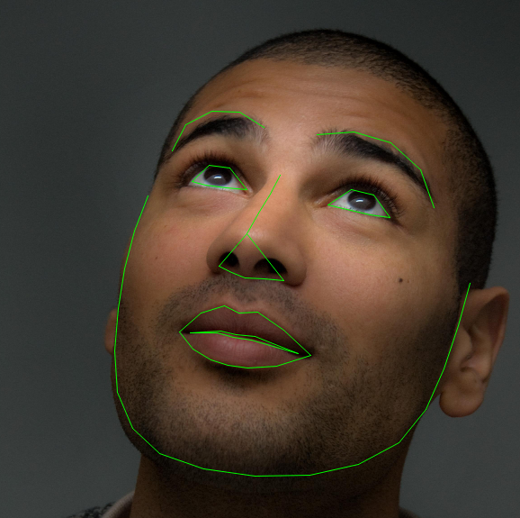
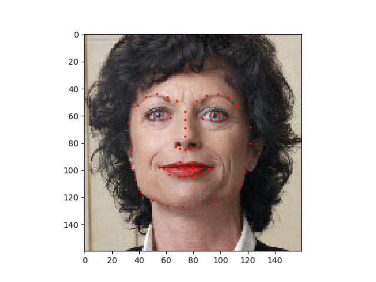

----

原文地址：https://pytorch.org/tutorials/beginner/data_loading_tutorial.html

译者：BING

时间：20190529

----

**作者**: [Sasank Chilamkurthy](https://chsasank.github.io/)

解决任何机器学习问题都需要投入很大的精力来准备数据。PyTorch提供了很多工具使数据加载变得容易，代码更可读。在本教程中，我们将看到如何加载并预处理/增强数据集。

为了运行这个教程，请确保下面的包已经安装完毕：

- `scikit-image`: 为了图片输入输出和转换
- `pandas`: 为了更容易解析`CSV`文件

```python
from __future__ import print_function, division
import os
import torch
import pandas as pd
from skimage import io, transform
import numpy as np
import matplotlib.pyplot as plt
from torch.utils.data import Dataset, DataLoader
from torchvision import transforms, utils

# 忽视warnings
import warnings
warnings.filterwarnings("ignore")

plt.ion()   # 交互模式
```

我们将处理的数据集是面部姿势数据。也就意味着数据标注如下：



> 总的来说，每张脸有68种不同的标记点。

注意：

> 从[这里](https://download.pytorch.org/tutorial/faces.zip) 下载数据集，图片存储到`/data/faces`文件夹。这个数据集实际上是通过在imagenet上的标记为脸的图片上应用 [dlib’s pose estimation](https://blog.dlib.net/2014/08/real-time-face-pose-estimation.html)生成。

数据集是用CSV文件存储，包含的标记格式是：

```bash
image_name,part_0_x,part_0_y,part_1_x,part_1_y,part_2_x, ... ,part_67_x,part_67_y
0805personali01.jpg,27,83,27,98, ... 84,134
1084239450_e76e00b7e7.jpg,70,236,71,257, ... ,128,312
```

我们快速读取CSV文件并且将标记读出为`(N, 2)`形状的数组，这楼里`N`是标记的数量。

```python
landmarks_frame = pd.read_csv('data/faces/face_landmarks.csv')

n = 65
img_name = landmarks_frame.iloc[n, 0]
landmarks = landmarks_frame.iloc[n, 1:].as_matrix()
landmarks = landmarks.astype('float').reshape(-1, 2)

print('Image name: {}'.format(img_name))
print('Landmarks shape: {}'.format(landmarks.shape))
print('First 4 Landmarks: {}'.format(landmarks[:4]))
```

输出：

```bash
Image name: person-7.jpg
Landmarks shape: (68, 2)
First 4 Landmarks: [[32. 65.]
 [33. 76.]
 [34. 86.]
 [34. 97.]]
```

我们写个简单的帮助函数来显示图片和它的标记，并用这个函数来显示一个样例。

```python
def show_landmarks(image, landmarks):
    """Show image with landmarks"""
    plt.imshow(image)
    plt.scatter(landmarks[:, 0], landmarks[:, 1], s=10, marker='.', c='r')
    plt.pause(0.001)  # pause a bit so that plots are updated

plt.figure()
show_landmarks(io.imread(os.path.join('data/faces/', img_name)),
               landmarks)
plt.show()
```



### 数据集类别

`torch.utils.data.Dataset` 是表示数据集的抽象类。定制的数据集应当继承`Dataset`并且重写下面的方法：

- `__len__`这样`len(dataset)`返回的就是数据集的大小。
- `__getitem__`用于支持索引，因此`dataset[i]`能用于获取第`i`个样本。

现在我们来为面部标注数据集创建一个数据集类。我们需要在`__init__`中读取`csv`文件，但是会在`__getitem__`中读取图片。这样会更加高效，因为所有的图片没有立刻存储在内存，但是读取的时候要求数据在内存中。

我们的数据集样本是一个字典：`{'image': image, 'landmarks': landmarks}`。我们的数据集将接收一个可选参数`transform`，因此任何需要的处理都能应用到样本上。我们将在下一部分看`transform`的使用。

```python
class FaceLandmarksDataset(Dataset): # 继承Dataset类
    """Face Landmarks dataset."""

    def __init__(self, csv_file, root_dir, transform=None):
        """
        Args:
            csv_file (string): 指向带有标注的csv文件地址
            root_dir (string): 存储图片的目录
            transform (callable, optional): 样本转换参数
        """
        self.landmarks_frame = pd.read_csv(csv_file)
        self.root_dir = root_dir
        self.transform = transform

    def __len__(self):
        return len(self.landmarks_frame)

    def __getitem__(self, idx):
        img_name = os.path.join(self.root_dir,
                                self.landmarks_frame.iloc[idx, 0])
        image = io.imread(img_name)
        landmarks = self.landmarks_frame.iloc[idx, 1:].as_matrix()
        landmarks = landmarks.astype('float').reshape(-1, 2)
        sample = {'image': image, 'landmarks': landmarks}

        if self.transform:
            sample = self.transform(sample)

        return sample
```

我们初始化这个类，并遍历所有的样本。我们将打印出前4个样本的尺寸以及展示它们的标注。

```python
face_dataset = FaceLandmarksDataset(csv_file='data/faces/face_landmarks.csv',
                                    root_dir='data/faces/')
fig = plt.figure()

for i in range(len(face_dataset)):
    sample = face_dataset[i]

    print(i, sample['image'].shape, sample['landmarks'].shape)

    ax = plt.subplot(1, 4, i + 1)
    plt.tight_layout()
    ax.set_title('Sample #{}'.format(i))
    ax.axis('off')
    show_landmarks(**sample)

    if i == 3:
        plt.show()
        break
```


**输出：**

```bash
0 (324, 215, 3) (68, 2)
1 (500, 333, 3) (68, 2)
2 (250, 258, 3) (68, 2)
3 (434, 290, 3) (68, 2)
```

### 转换

有个问题是样本的大小并不相同。大部分神经网络都需要输入图片大小固定。因此，我们需要写一些预处理代码。现在我们创建3个转换：

- `Rescale`: 放缩图片。
- `RandomCrop`: 从图片随机裁剪，这是数据增强。
- `ToTensor`: 将Numpy格式的图片转换为Torch格式图片（我们需要交换轴）。

我们将这些转换写成可调用类，而不是简单的函数，因此转换的参数不用每次调用时都传递一次。为了实现这个，我们只需要实现`__call__`方法，如果需要，还实现`__init__`方法。我们将用下面的方式使用转换：

```
tsfm = Transform(params)
transformed_sample = tsfm(sample)
```

观察下面这些转换是如何应用在图片和标记上的。

```python
class Rescale(object):
    """图片样本放缩到指定大小

    Args:
        output_size (tuple or int): 目标输出尺寸，如果是元组，输出需要匹配到output_size, 如果是int，图片的较小边会匹配到output_size,并保持图片的宽高比相同
    """

    def __init__(self, output_size):
        assert isinstance(output_size, (int, tuple))
        self.output_size = output_size

    def __call__(self, sample):
        image, landmarks = sample['image'], sample['landmarks']

        h, w = image.shape[:2]
        if isinstance(self.output_size, int):
            if h > w:
                new_h, new_w = self.output_size * h / w, self.output_size
            else:
                new_h, new_w = self.output_size, self.output_size * w / h
        else:
            new_h, new_w = self.output_size

        new_h, new_w = int(new_h), int(new_w)

        img = transform.resize(image, (new_h, new_w))

        # h and w are swapped for landmarks because for images,
        # x and y axes are axis 1 and 0 respectively
        landmarks = landmarks * [new_w / w, new_h / h]

        return {'image': img, 'landmarks': landmarks}


class RandomCrop(object):
    """ 随机裁剪图片。

    Args:
        output_size (tuple or int): Desired output size. If int, square crop
            is made.
    """

    def __init__(self, output_size):
        assert isinstance(output_size, (int, tuple))
        if isinstance(output_size, int):
            self.output_size = (output_size, output_size)
        else:
            assert len(output_size) == 2
            self.output_size = output_size

    def __call__(self, sample):
        image, landmarks = sample['image'], sample['landmarks']

        h, w = image.shape[:2]
        new_h, new_w = self.output_size

        top = np.random.randint(0, h - new_h)
        left = np.random.randint(0, w - new_w)

        image = image[top: top + new_h,
                      left: left + new_w]

        landmarks = landmarks - [left, top]

        return {'image': image, 'landmarks': landmarks}


class ToTensor(object):
    """将ndarrays转换为Tensors."""

    def __call__(self, sample):
        image, landmarks = sample['image'], sample['landmarks']

        # swap color axis because
        # numpy image: H x W x C
        # torch image: C X H X W
        image = image.transpose((2, 0, 1))
        return {'image': torch.from_numpy(image),
                'landmarks': torch.from_numpy(landmarks)}
```

### 组合转换

现在我们将转换应用到样本上。

我们想将图片的最短边缩小到256，然后随机从中裁剪出224大小。我们就可以组合`Rescale`和`RandomCrop`转换。`torchvision.transforms.Compose`就是这样一个可以完成此功能的简单的可调用类。

```python
scale = Rescale(256)
crop = RandomCrop(128)
composed = transforms.Compose([Rescale(256),
                               RandomCrop(224)])

# 将这些转换全部应用到样本上
fig = plt.figure()
sample = face_dataset[65]
for i, tsfrm in enumerate([scale, crop, composed]):
    transformed_sample = tsfrm(sample)

    ax = plt.subplot(1, 3, i + 1)
    plt.tight_layout()
    ax.set_title(type(tsfrm).__name__)
    show_landmarks(**transformed_sample)

plt.show()
```


### 遍历数据集

现在我们将这些组合在一起创建一个数据集。总的来说，每次数据采样时：

- 图片即时从文件中读取

- 在读取的图片上应用转换
- 因为有一种转换是随机，可以在样本上进行数据增强

我们可以迭代以创建数据集，用一个`for i in range`循环。

```python
transformed_dataset = FaceLandmarksDataset(csv_file='data/faces/face_landmarks.csv',
                                           root_dir='data/faces/',
                                           transform=transforms.Compose([
                                               Rescale(256),
                                               RandomCrop(224),
                                               ToTensor()
                                           ]))

for i in range(len(transformed_dataset)):
    sample = transformed_dataset[i]

    print(i, sample['image'].size(), sample['landmarks'].size())

    if i == 3:
        break
```

输出:

```bash
0 torch.Size([3, 224, 224]) torch.Size([68, 2])
1 torch.Size([3, 224, 224]) torch.Size([68, 2])
2 torch.Size([3, 224, 224]) torch.Size([68, 2])
3 torch.Size([3, 224, 224]) torch.Size([68, 2])
```

然而，如果简单的用`for`循环来迭代数据，我们会损失很多特征。尤其是我们会无法：

- 批量数据
- 随机打乱数据
- 使用多个进程并行加载数据

`torch.utils.data.DataLoader` 是一个迭代器，能够提供所有的这些特征。参数的使用也更清晰。一个有趣的参数是`callate_fn`。你可以使用这个函数在指定样本如何做批量。然而，默认情况对大部分情况都够用。

```python
dataloader = DataLoader(transformed_dataset, batch_size=4,
                        shuffle=True, num_workers=4)


# Helper function to show a batch
def show_landmarks_batch(sample_batched):
    """Show image with landmarks for a batch of samples."""
    images_batch, landmarks_batch = \
            sample_batched['image'], sample_batched['landmarks']
    batch_size = len(images_batch)
    im_size = images_batch.size(2)
    grid_border_size = 2

    grid = utils.make_grid(images_batch)
    plt.imshow(grid.numpy().transpose((1, 2, 0)))

    for i in range(batch_size):
        plt.scatter(landmarks_batch[i, :, 0].numpy() + i * im_size + (i + 1) * grid_border_size,
                    landmarks_batch[i, :, 1].numpy() + grid_border_size,
                    s=10, marker='.', c='r')

        plt.title('Batch from dataloader')

for i_batch, sample_batched in enumerate(dataloader):
    print(i_batch, sample_batched['image'].size(),
          sample_batched['landmarks'].size())

    # observe 4th batch and stop.
    if i_batch == 3:
        plt.figure()
        show_landmarks_batch(sample_batched)
        plt.axis('off')
        plt.ioff()
        plt.show()
        break
```


输出:

```bash
0 torch.Size([4, 3, 224, 224]) torch.Size([4, 68, 2])
1 torch.Size([4, 3, 224, 224]) torch.Size([4, 68, 2])
2 torch.Size([4, 3, 224, 224]) torch.Size([4, 68, 2])
3 torch.Size([4, 3, 224, 224]) torch.Size([4, 68, 2])
```

### 结语：torchvision

在本教程中，我们看到了如何编写和使用数据集、转换器以及数据加载器。`torchvision`包提供了一些常用数据集和转换器。你可能都不用自己写定制的类。`torchvision`中有一个更加泛化的可用的数据集是`ImageFolder`。它假定图片按照下面的方式进行组织：

```bash
root/ants/xxx.png
root/ants/xxy.jpeg
root/ants/xxz.png
.
.
.
root/bees/123.jpg
root/bees/nsdf3.png
root/bees/asd932_.png
```

这里`ants`，`bees`等是类别标签。相似的泛化的转换是在`PIL.Image`格式的数据上进行变换，`RandomHorizontalFlip`，`Scale`都是可用的。可以用这些来写数据加载器：

```python
import torch
from torchvision import transforms, datasets

data_transform = transforms.Compose([
        transforms.RandomSizedCrop(224),
        transforms.RandomHorizontalFlip(),
        transforms.ToTensor(),
        transforms.Normalize(mean=[0.485, 0.456, 0.406],
                             std=[0.229, 0.224, 0.225])
    ])
hymenoptera_dataset = datasets.ImageFolder(root='hymenoptera_data/train',
                                           transform=data_transform)
dataset_loader = torch.utils.data.DataLoader(hymenoptera_dataset,
                                             batch_size=4, shuffle=True,
                                             num_workers=4)
```

For an example with training code, please see [Transfer Learning Tutorial](https://pytorch.org/tutorials/beginner/transfer_learning_tutorial.html).

如果想看训练代码的样例，请看 [迁移学习教程](https://pytorch.org/tutorials/beginner/transfer_learning_tutorial.html)。

END.