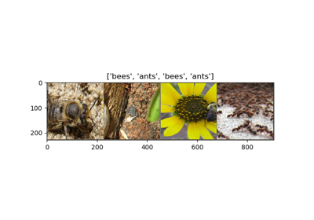
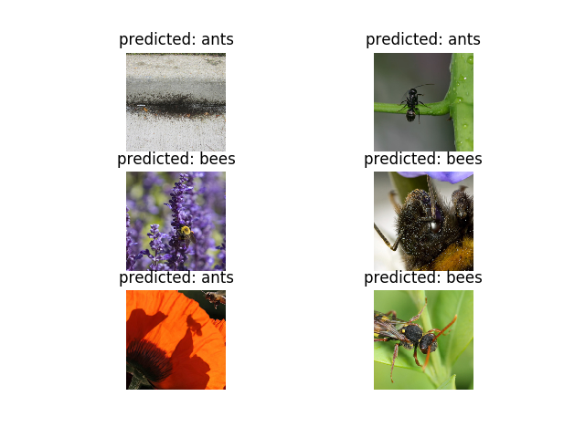
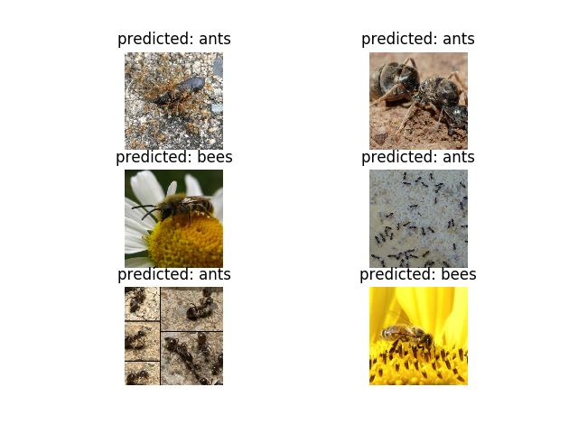

----

原文链接：https://pytorch.org/tutorials/beginner/transfer_learning_tutorial.html

时间：20190601

译者：BING

-----

**作者**: [Sasank Chilamkurthy](https://chsasank.github.io/)

本教程，你讲学习到如何使用迁移学习来训练网络。可以学 [cs231n 笔记](https://cs231n.github.io/transfer-learning/)了解更多迁移学习内容。

引用这些笔记：

> 实际上，很少有人会从零开始训练一个CNN网络(随机初始化)，因为很难得到足够多的数据集。相反，通常我们会在很大的数据集上预训练一个卷积网络(比如：ImageNet，包含120万图片，1000类)，然后将卷积网络作为初始化或者固定的特征提取器。

迁移学习的两大应用场景如下：

- **调优卷积网络**：不用随机初始化，而是使用预训练网络来初始化网络，比如在1000类数据集上训练，剩下的过程和平常相同。
- **卷积网络作为固定特征提取器**：这里我们冻结网络权重，除了最后的全连接层。最后的全连接层用新的随机权重初始化，只训练这一层。

```python
# License: BSD
# Author: Sasank Chilamkurthy

from __future__ import print_function, division

import torch
import torch.nn as nn
import torch.optim as optim
from torch.optim import lr_scheduler
import numpy as np
import torchvision
from torchvision import datasets, models, transforms
import matplotlib.pyplot as plt
import time
import os
import copy

plt.ion()   # 交互模式
```

## 加载数据

我们使用`torchvision`和`torch.utils.data`包来加载数据。

现在我们需要解决的问题是训练一个模型来分类**蚂蚁**和**蜜蜂**。我们有每类120张训练图片，75张验证图片。通常，这是很少的数据集，如果从零开始训练，很难泛化。而使用迁移学习，我们就能非常合理得泛化模型。

数据集是`imagenet`的一个很小的子集。

注意：

从[这里](https://download.pytorch.org/tutorial/hymenoptera_data.zip)下载数据，并解压到当前目录。

```python
# 数据增强和正态化，用于训练
# 只正态化用于验证
data_transforms = {
    'train': transforms.Compose([
        transforms.RandomResizedCrop(224),
        transforms.RandomHorizontalFlip(),
        transforms.ToTensor(),
        transforms.Normalize([0.485, 0.456, 0.406], [0.229, 0.224, 0.225]) # 数字含义是什么？
    ]),
    'val': transforms.Compose([
        transforms.Resize(256),
        transforms.CenterCrop(224),
        transforms.ToTensor(),
        transforms.Normalize([0.485, 0.456, 0.406], [0.229, 0.224, 0.225])
    ]),
}

data_dir = 'data/hymenoptera_data'
image_datasets = {x: datasets.ImageFolder(os.path.join(data_dir, x),
                                          data_transforms[x])
                  for x in ['train', 'val']}
dataloaders = {x: torch.utils.data.DataLoader(image_datasets[x], batch_size=4,
                                             shuffle=True, num_workers=4)
              for x in ['train', 'val']}
dataset_sizes = {x: len(image_datasets[x]) for x in ['train', 'val']}
class_names = image_datasets['train'].classes

device = torch.device("cuda:0" if torch.cuda.is_available() else "cpu")
```

### 可视化几张图片

我们先看几张训练图，用于理解数据增强。

```python
def imshow(inp, title=None):
    """Imshow for Tensor."""
    inp = inp.numpy().transpose((1, 2, 0))
    mean = np.array([0.485, 0.456, 0.406])
    std = np.array([0.229, 0.224, 0.225])
    inp = std * inp + mean
    inp = np.clip(inp, 0, 1)
    plt.imshow(inp)
    if title is not None:
        plt.title(title)
    plt.pause(0.001)  # pause a bit so that plots are updated


# 得到一组训练数据
inputs, classes = next(iter(dataloaders['train']))

# Make a grid from batch
out = torchvision.utils.make_grid(inputs)
imshow(out, title=[class_names[x] for x in classes])
```



## 训练模型

现在我们写个通用函数来训练模型，这里我们将展示：

- 调整学习率
- 存储最佳模型

下面，参数`scheduler`是一个LR调度程序对象，是从`torch.optim.lr_scheduler`生成。

```python
def train_model(model, criterion, optimizer, scheduler, num_epochs=25):
    '''
    	Args：
    		model: 模型
    		criterion: 模型输出和真实输出之间的差值，即计算损失函数
    		optimizer: 用于优化损失函数
    		scheduler: 学习率调度
    		num_epochs: 训练的轮数
    '''  
    since = time.time()

    best_model_wts = copy.deepcopy(model.state_dict())
    best_acc = 0.0

    for epoch in range(num_epochs):
        print('Epoch {}/{}'.format(epoch, num_epochs - 1)) # .format是推荐的最佳的字符串格式化方法
        print('-' * 10)

        # 每一轮都有训练和验证阶段
        for phase in ['train', 'val']:
            if phase == 'train':
                scheduler.step()
                model.train()  # 将模型设定为训练模式
            else:
                model.eval()   # 将模型设定为评估模式

            running_loss = 0.0
            running_corrects = 0

            # 迭代数据
            for inputs, labels in dataloaders[phase]:
                inputs = inputs.to(device)
                labels = labels.to(device)

                #  参数梯度置零
                optimizer.zero_grad()

                # 前向
                # 只在训练时追踪历史
                with torch.set_grad_enabled(phase == 'train'):
                    outputs = model(inputs)
                    _, preds = torch.max(outputs, 1)
                    loss = criterion(outputs, labels)

                    # 反向传播 + 优化，只在训练阶段
                    if phase == 'train':
                        loss.backward()
                        optimizer.step()

                # 统计特征
                running_loss += loss.item() * inputs.size(0)
                running_corrects += torch.sum(preds == labels.data)

            epoch_loss = running_loss / dataset_sizes[phase]
            epoch_acc = running_corrects.double() / dataset_sizes[phase]

            print('{} Loss: {:.4f} Acc: {:.4f}'.format(
                phase, epoch_loss, epoch_acc))

            # 深度拷贝模型
            if phase == 'val' and epoch_acc > best_acc:
                best_acc = epoch_acc
                best_model_wts = copy.deepcopy(model.state_dict())

        print()

    time_elapsed = time.time() - since
    print('Training complete in {:.0f}m {:.0f}s'.format(
        time_elapsed // 60, time_elapsed % 60))
    print('Best val Acc: {:4f}'.format(best_acc))

    # 加载最优模型参数
    model.load_state_dict(best_model_wts)
    return model
```

### 可视化模型预测

在图片上显示预测的通用函数：

```python
def visualize_model(model, num_images=6):
    was_training = model.training
    model.eval() # why here?
    images_so_far = 0
    fig = plt.figure()

    with torch.no_grad(): # 不追踪梯度历史
        for i, (inputs, labels) in enumerate(dataloaders['val']):
            inputs = inputs.to(device)
            labels = labels.to(device)

            outputs = model(inputs) # 模型输出
            _, preds = torch.max(outputs, 1)

            for j in range(inputs.size()[0]):
                images_so_far += 1
                ax = plt.subplot(num_images//2, 2, images_so_far)
                ax.axis('off')
                ax.set_title('predicted: {}'.format(class_names[preds[j]]))
                imshow(inputs.cpu().data[j])

                if images_so_far == num_images:
                    model.train(mode=was_training)
                    return
        model.train(mode=was_training)
```

## 调优卷积网络

加载预训练模型并且重置最后的全连接层。

```python
model_ft = models.resnet18(pretrained=True)
num_ftrs = model_ft.fc.in_features
model_ft.fc = nn.Linear(num_ftrs, 2)

model_ft = model_ft.to(device) # 模型移动到设备

criterion = nn.CrossEntropyLoss()

# 观察所有的参数都被优化
optimizer_ft = optim.SGD(model_ft.parameters(), lr=0.001, momentum=0.9)

#  每7轮：LR = 0.1 * LR
exp_lr_scheduler = lr_scheduler.StepLR(optimizer_ft, step_size=7, gamma=0.1)
```

### 训练和评估

 在CPU上需要消耗15~25分钟才能完成训练，在GPU上，只需要不到1分钟就可以完成训练：

```python
model_ft = train_model(model_ft, criterion, optimizer_ft, exp_lr_scheduler,
                       num_epochs=25)
```

输出:

```bash
Epoch 0/24
----------
train Loss: 0.7543 Acc: 0.6885
val Loss: 0.2147 Acc: 0.8954

Epoch 1/24
----------
train Loss: 0.3645 Acc: 0.8238
val Loss: 0.2726 Acc: 0.9150

Epoch 2/24
----------
train Loss: 0.5103 Acc: 0.7910
val Loss: 0.2827 Acc: 0.9020

Epoch 3/24
----------
train Loss: 0.4323 Acc: 0.8238
val Loss: 0.3189 Acc: 0.8954

Epoch 4/24
----------
train Loss: 0.4762 Acc: 0.8156
val Loss: 0.3082 Acc: 0.8889

Epoch 5/24
----------
train Loss: 0.5534 Acc: 0.7746
val Loss: 0.4267 Acc: 0.9085

Epoch 6/24
----------
train Loss: 0.4077 Acc: 0.8525
val Loss: 0.3122 Acc: 0.9150

Epoch 7/24
----------
train Loss: 0.3075 Acc: 0.8934
val Loss: 0.3311 Acc: 0.9085

Epoch 8/24
----------
train Loss: 0.2923 Acc: 0.8934
val Loss: 0.3074 Acc: 0.8954

Epoch 9/24
----------
train Loss: 0.3800 Acc: 0.8443
val Loss: 0.3819 Acc: 0.8824

Epoch 10/24
----------
train Loss: 0.2675 Acc: 0.8934
val Loss: 0.2620 Acc: 0.9150

Epoch 11/24
----------
train Loss: 0.2777 Acc: 0.8689
val Loss: 0.2472 Acc: 0.9150

Epoch 12/24
----------
train Loss: 0.3194 Acc: 0.8607
val Loss: 0.2427 Acc: 0.9346

Epoch 13/24
----------
train Loss: 0.2229 Acc: 0.8934
val Loss: 0.2426 Acc: 0.9281

Epoch 14/24
----------
train Loss: 0.3491 Acc: 0.8730
val Loss: 0.2393 Acc: 0.9281

Epoch 15/24
----------
train Loss: 0.3963 Acc: 0.8402
val Loss: 0.2414 Acc: 0.9281

Epoch 16/24
----------
train Loss: 0.1934 Acc: 0.9262
val Loss: 0.2423 Acc: 0.9281

Epoch 17/24
----------
train Loss: 0.3085 Acc: 0.8607
val Loss: 0.2551 Acc: 0.9216

Epoch 18/24
----------
train Loss: 0.2942 Acc: 0.8852
val Loss: 0.3106 Acc: 0.9020

Epoch 19/24
----------
train Loss: 0.3410 Acc: 0.8525
val Loss: 0.2689 Acc: 0.9085

Epoch 20/24
----------
train Loss: 0.2542 Acc: 0.8811
val Loss: 0.2498 Acc: 0.9216

Epoch 21/24
----------
train Loss: 0.2854 Acc: 0.8975
val Loss: 0.2435 Acc: 0.9281

Epoch 22/24
----------
train Loss: 0.3810 Acc: 0.8566
val Loss: 0.2401 Acc: 0.9346

Epoch 23/24
----------
train Loss: 0.3178 Acc: 0.8689
val Loss: 0.2471 Acc: 0.9150

Epoch 24/24
----------
train Loss: 0.1776 Acc: 0.9385
val Loss: 0.2504 Acc: 0.9346

Training complete in 1m 8s
Best val Acc: 0.934641
visualize_model(model_ft)
```



## 卷积网络作为固定的特征提取器

这里我们需要冻结网络的除了最后一层的其他层。我们设定`requires_grad`为`False`来冻结参数，这样梯度就不会在`backward()`中计算（不计算就不会更新，就等同于参数被冻结）。

可以阅读[这里](https://pytorch.org/docs/notes/autograd.html#excluding-subgraphs-from-backward)的文档了解更多。

```python
model_conv = torchvision.models.resnet18(pretrained=True)
for param in model_conv.parameters():
    param.requires_grad = False

# 默认情况下，新构建的模块的参数`requires_grad=True`
num_ftrs = model_conv.fc.in_features
model_conv.fc = nn.Linear(num_ftrs, 2)

model_conv = model_conv.to(device)

criterion = nn.CrossEntropyLoss()

# Observe that only parameters of final layer are being optimized as
# opposed to before.
optimizer_conv = optim.SGD(model_conv.fc.parameters(), lr=0.001, momentum=0.9)

# Decay LR by a factor of 0.1 every 7 epochs
exp_lr_scheduler = lr_scheduler.StepLR(optimizer_conv, step_size=7, gamma=0.1)
```

### 训练和评估

在CPU上这将需要前面场景的时间的一半。对于大部分网络而言，梯度无需再计算。但是前向过程需要再计算。

```python
model_conv = train_model(model_conv, criterion, optimizer_conv,
                         exp_lr_scheduler, num_epochs=25)
```

输出:

```bash
Epoch 0/24
----------
train Loss: 0.5500 Acc: 0.6885
val Loss: 0.5290 Acc: 0.7516

Epoch 1/24
----------
train Loss: 0.4999 Acc: 0.7746
val Loss: 0.3054 Acc: 0.8562

Epoch 2/24
----------
train Loss: 0.5138 Acc: 0.7664
val Loss: 0.2423 Acc: 0.9020

Epoch 3/24
----------
train Loss: 0.5345 Acc: 0.7787
val Loss: 0.3587 Acc: 0.8497

Epoch 4/24
----------
train Loss: 0.6233 Acc: 0.7500
val Loss: 0.1807 Acc: 0.9281

Epoch 5/24
----------
train Loss: 0.4628 Acc: 0.8238
val Loss: 0.1572 Acc: 0.9542

Epoch 6/24
----------
train Loss: 0.3780 Acc: 0.8279
val Loss: 0.1582 Acc: 0.9542

Epoch 7/24
----------
train Loss: 0.3566 Acc: 0.8484
val Loss: 0.2216 Acc: 0.9216

Epoch 8/24
----------
train Loss: 0.2971 Acc: 0.8893
val Loss: 0.1802 Acc: 0.9412

Epoch 9/24
----------
train Loss: 0.3736 Acc: 0.8279
val Loss: 0.1694 Acc: 0.9412

Epoch 10/24
----------
train Loss: 0.2979 Acc: 0.8566
val Loss: 0.1733 Acc: 0.9346

Epoch 11/24
----------
train Loss: 0.3635 Acc: 0.8443
val Loss: 0.1710 Acc: 0.9477

Epoch 12/24
----------
train Loss: 0.3168 Acc: 0.8730
val Loss: 0.1954 Acc: 0.9281

Epoch 13/24
----------
train Loss: 0.4168 Acc: 0.8197
val Loss: 0.1816 Acc: 0.9346

Epoch 14/24
----------
train Loss: 0.3329 Acc: 0.8811
val Loss: 0.2067 Acc: 0.9020

Epoch 15/24
----------
train Loss: 0.3745 Acc: 0.8443
val Loss: 0.1856 Acc: 0.9346

Epoch 16/24
----------
train Loss: 0.3573 Acc: 0.8279
val Loss: 0.1950 Acc: 0.9216

Epoch 17/24
----------
train Loss: 0.3074 Acc: 0.8443
val Loss: 0.1559 Acc: 0.9477

Epoch 18/24
----------
train Loss: 0.3110 Acc: 0.8730
val Loss: 0.1761 Acc: 0.9281

Epoch 19/24
----------
train Loss: 0.2955 Acc: 0.8770
val Loss: 0.1753 Acc: 0.9346

Epoch 20/24
----------
train Loss: 0.3200 Acc: 0.8730
val Loss: 0.1670 Acc: 0.9412

Epoch 21/24
----------
train Loss: 0.2707 Acc: 0.8852
val Loss: 0.1967 Acc: 0.9346

Epoch 22/24
----------
train Loss: 0.3816 Acc: 0.8361
val Loss: 0.1680 Acc: 0.9412

Epoch 23/24
----------
train Loss: 0.3964 Acc: 0.8320
val Loss: 0.2041 Acc: 0.9346

Epoch 24/24
----------
train Loss: 0.4404 Acc: 0.8033
val Loss: 0.1613 Acc: 0.9412

Training complete in 0m 35s
Best val Acc: 0.954248
```



```python
visualize_model(model_conv)

plt.ioff()
plt.show()
```

