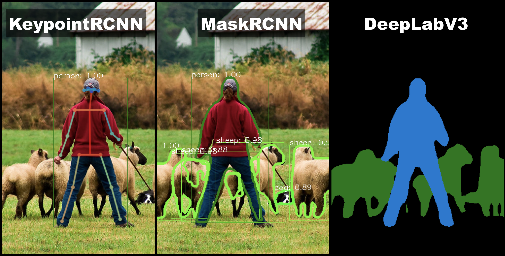

----

原文链接：https://pytorch.org/blog/torchvision03/

译者：BING

时间：20190529

----

PyTorch中像`torchvision`这样的库是很方便的访问常用的数据集和模型的方式，能够用来快速创建最新的基线。而且，它们也提供了常用的抽象以减少模板代码，否则用户就得重复编写这些代码。`torchvision 0.3`的发布带来了几个新特性，包括语义分割、物体检测、实例分割以及人的关键点检测模型，还有定制的针对计算机视觉的C++/CUDA操作。



###  新特性包括：

**训练/评估脚本**：在`references/`文件夹中`torchvision`提供了用于训练和评估下面几个任务的脚本：分类，语义分割，物体检测，实例分割以及人的关键点检测。这些 为如何训练一个特定模型并提供一个训练和评估用的基础脚本用于快速开启研究。

**torchvision ops:**torchvision现在包含有定制的C++/CUDA操作。这些操作是针对计算机视觉的，使得构建物体检测模型更容易了。这些操作现在还不支持PyTorch脚本模式，但是在下一版本发布计划支持。一些支持操作如下：

- roi_pool(以及模块版本RoiPool)
- roi_align (以及模块版本 RoIAlign)
- nms, 用于边界框的非最大抑制
- box_iou,用于计算IoU，两个边界框的交集计算
- box_area, 用于计算边界框的面积

下面是几个使用torchvision操作的几个案例：

```python
import torch
import torchvision

# 创建10个随机的边界框
boxes = torch.rand(10, 4) * 100
# 需要变成 [x0, y0, x1, y1] 格式
boxes[:, 2:] += boxes[:, :2]
# 创建一个随机图片
image = torch.rand(1, 3, 200, 200)
# extract regions in `image` defined in `boxes`, rescaling
# them to have a size of 3x3
pooled_regions = torchvision.ops.roi_align(image, [boxes], output_size=(3, 3))
# check the size
print(pooled_regions.shape)
# torch.Size([10, 3, 3, 3])

# or compute the intersection over union between
# all pairs of boxes
print(torchvision.ops.box_iou(boxes, boxes).shape)
# torch.Size([10, 10])
```

**新的模型和数据集**：torchvision现在添加了物体检测，实例分割和人关键点检测模型。此外，几个流行的数据集也被加入了。注意：这些API现在还在试验阶段，可能会在未来版本中变化。新模型包含：

### 分割模型

0.3版本也包含图片像素密度预测模型。它加入了FCN和DeepLabV3分割模型，使用ResNet50和ResNet101作为骨架网络。ResNet101骨架网络的预训练权重可用，且是在COCO train2017数据集的子集上进行的训练，包含20类和Pascal VOC相同的类别。

预训练模型在COCO val2017验证集的子集（包含Pascal VOC中的20个类别）上的表现如下：

| 网络             | 均值IoU | 全局像素准确率 |
| ------------------- | -------- | -------------------- |
| FCN ResNet101       | 63.7     | 91.9                 |
| DeepLabV3 ResNet101 | 67.4     | 92.4                 |

### 检测模型

| 网络                                         | 方框AP | 遮罩AP | 关键点AP |
| -------------------------------------------- | ------ | ------ | -------- |
| Faster R-CNN ResNet-50 FPN trained on COCO   | 37.0   |        |          |
| Mask R-CNN ResNet-50 FPN trained on COCO     | 37.9   | 34.6   |          |
| Keypoint R-CNN ResNet-50 FPN trained on COCO | 54.6   |        | 65.0     |

用于物体检测、实例分割和关键点检测的模型实现很快，尤其是在训练期间。

下面的表格，我们用8块V100GPU，使用CUDA 10.0和CUDNN 7.4来报告结果。在训练期间，我们为每个GPU设定的batch大小是2，测试期间的batch大小是1。

测试期间，我们报告了用于模型评估和后处理(包含遮罩添加)的时间，但是计算精确率和召回率的时间不算在内。

| 网络                         | 训练时间 (s / it) | 测试时间 (s / it) | 内存 (GB) |
| ---------------------------- | ----------------- | ----------------- | --------- |
| Faster R-CNN ResNet-50 FPN   | 0.2288            | 0.0590            | 5.2       |
| Mask R-CNN ResNet-50 FPN     | 0.2728            | 0.0903            | 5.4       |
| Keypoint R-CNN ResNet-50 FPN | 0.3789            | 0.1242            | 6.8       |

可以加载并使用预训练的检测分割模型，几行代码就能完成：

```python
import torchvision

model = torchvision.models.detection.maskrcnn_resnet50_fpn(pretrained=True)
# 设置为评估模式，模型在评估期间的表现不同于训练
model.eval()

image = PIL.Image.open('/path/to/an/image.jpg') # 修改图片路径
image_tensor = torchvision.transforms.functional.to_tensor(image) # 变成张量

# 向模型传递一个张量列表(可能是不同大小的)，范围在0~1之间
# 模型会分批次并正态化数据
output = model([image_tensor])
# 输出一个字典列表，包含处理后的预测
```

### 分类模型

下面的分类模型也添加进来了：

- GoogLeNet (Inception v1)
- MobileNet V2
- ShuffleNet v2
- ResNeXt-50 32x4d and ResNeXt-101 32x8d

### 数据集

下面的数据集也被加载进来了：

- Caltech101, Caltech256, and CelebA
- ImageNet数据集 (ImageFolder有提升，提供类别字符串)
- 语义分割边界数据集
- VisionDataset作为所有数据集的基础类

此外，我们还添加了更多图片转换，广泛的提升和bug修复，以及改进的文档。

点击[这里](https://github.com/pytorch/vision/releases)参考全部的发布信息，并开始在[Google Colab](https://colab.research.google.com/github/pytorch/vision/blob/temp-tutorial/tutorials/torchvision_finetuning_instance_segmentation.ipynb)上开始实验，也包含了如何在自己的数据集上调优自己的实例分割模型。

***

欢呼吧! 

PyTorch团队

