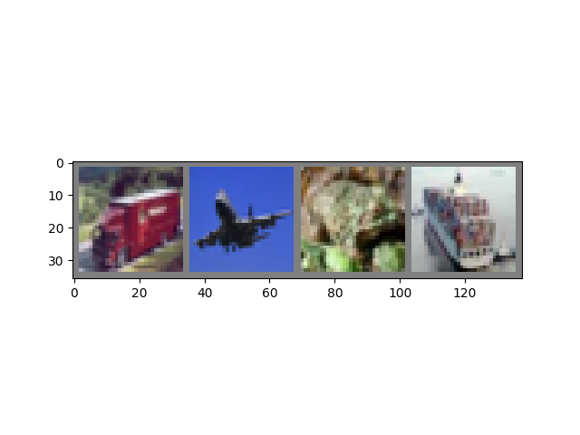
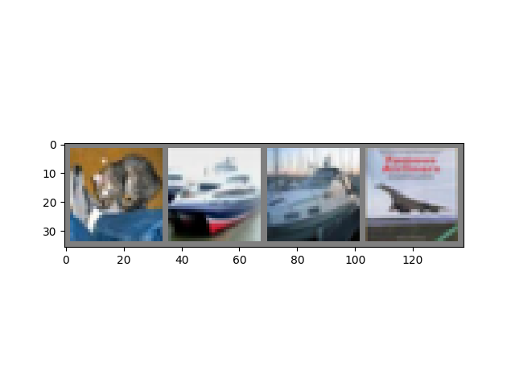

----

原文链接：https://pytorch.org/tutorials/beginner/blitz/cifar10_tutorial.html#sphx-glr-beginner-blitz-cifar10-tutorial-py

译者：BING

时间：20190528

----

你已经了解了如何定义一个神经网络，计算损失函数和更新网络权重。

现在你或许在思考：

### 数据怎么办呢？

通常来说，当你需要处理图片，文本，音频后者视频数据时，你可以使用标准的Python包加载数据为Numpy数组。然后你可以将该数组转换为`torch.*Tensor`。

- 对于图片数据，如`Pillow`, `OpenCV`包很有用
- 对于音频数据，`scipy`包和`librosa`包很有用
- 对于文本数据，要么是使用原生Python或者Cython来加载，或者用`NLTK`和`SpaCy`包

特别的，对于视觉而言，我们创建了一个包，叫`torchvision`，它拥有通用数据集的加载器，如`Imagenet`，`CIFAR10`，`MNIST`等。并且还提供图像数据转换器，即`torchvision.datasets`和`torch.utils.data.DataLoader`。

这提供了很大的便利性，可以避免重复造轮子。

对于本教程，我们使用`CIFAR10`数据集，它有这些类：‘airplane’, ‘automobile’, ‘bird’, ‘cat’, ‘deer’, ‘dog’, ‘frog’, ‘horse’, ‘ship’, ‘truck’。CIFAR-10中的图像数据尺寸是`3x32x32`大小，也即3个颜色通道的图片，32x32大小。


## 训练图像分类器

我们按照下面的步骤顺序：

1. 加载并正态化CIFAR10训练集和测试集，使用`torchvision`包
2. 定义卷积神经网络
3. 定义损失函数
4. 在训练集上训练神经网络
5. Test the network on the test data
6. 在测试集上测试网络

### 1. 加载并正态化CIFAR10

使用`torchvision`，可以非常容易加载CIFAR10数据集。

```python
import torch
import torchvision
import torchvision.transforms as transforms
```

`torchvision`数据集的输出是PILImage图片，数字范围在[0,1]之间。我们将它们转换为范围在[-1, 1]之间的张量。

```python
transform = transforms.Compose(
    [
    	transforms.ToTensor(), # 变成张量
     	transforms.Normalize((0.5, 0.5, 0.5), (0.5, 0.5, 0.5)) # 正态化
     ]) 

trainset = torchvision.datasets.CIFAR10(root='./data', train=True,
                                        download=True, transform=transform)
trainloader = torch.utils.data.DataLoader(trainset, batch_size=4,
                                          shuffle=True, num_workers=2)

testset = torchvision.datasets.CIFAR10(root='./data', train=False,
                                       download=True, transform=transform)
testloader = torch.utils.data.DataLoader(testset, batch_size=4,
                                         shuffle=False, num_workers=2)

classes = ('plane', 'car', 'bird', 'cat',
           'deer', 'dog', 'frog', 'horse', 'ship', 'truck')
```

输出:

```bash
Downloading https://www.cs.toronto.edu/~kriz/cifar-10-python.tar.gz to ./data/cifar-10-python.tar.gz
Files already downloaded and verified
```

我们展示几个训练图片看看：

```python
import matplotlib.pyplot as plt
import numpy as np

# 用于显示图片的函数
def imshow(img):
    img = img / 2 + 0.5     # 去正态化
    npimg = img.numpy() # 转换为Numpy数组
    plt.imshow(np.transpose(npimg, (1, 2, 0)))
    plt.show()

# 从训练集中随机拿几个图片
dataiter = iter(trainloader)
images, labels = dataiter.next()

# 显示图片
imshow(torchvision.utils.make_grid(images))
# 打印类别
print(' '.join('%5s' % classes[labels[j]] for j in range(4)))
```



输出:

```bash
truck plane  frog  ship
```

### 2. 定义卷积网络

从神经网络初探这篇文章中拷贝代码（尽量做到代码复用，不用每次都从零开始写）到这里来，并把图片通道改为3-通道，原先代码中定义的是单通道。

```python
import torch.nn as nn
import torch.nn.functional as F

class Net(nn.Module):
    def __init__(self):
        super(Net, self).__init__()
        self.conv1 = nn.Conv2d(3, 6, 5) # 3表示图片是3通道，6表示输出通道，也是卷积核的个数，5是卷积尺寸，表示5x5
        self.pool = nn.MaxPool2d(2, 2)
        self.conv2 = nn.Conv2d(6, 16, 5)
        self.fc1 = nn.Linear(16 * 5 * 5, 120)
        self.fc2 = nn.Linear(120, 84)
        self.fc3 = nn.Linear(84, 10)

    def forward(self, x):
        x = self.pool(F.relu(self.conv1(x)))
        x = self.pool(F.relu(self.conv2(x)))
        x = x.view(-1, 16 * 5 * 5)
        x = F.relu(self.fc1(x))
        x = F.relu(self.fc2(x))
        x = self.fc3(x)
        return x

net = Net()
```

### 3. 定义损失函数和优化器

我们使用分类交叉损失函数和SGD+动量优化器。

```python
import torch.optim as optim

criterion = nn.CrossEntropyLoss() # 损失函数
optimizer = optim.SGD(net.parameters(), lr=0.001, momentum=0.9) # 优化器
```

### 4. 训练网络

现在事情开始变得有趣了。我们简单的循环迭代数据，并将数据输入到网络然后开始优化。

```python
for epoch in range(2):  # 在数据集上循环迭代多次
    running_loss = 0.0
    for i, data in enumerate(trainloader, 0):
        # 获取输入，数据是列表形式：[inputs, labels]
        inputs, labels = data

        # 参数梯度清零
        optimizer.zero_grad()
		
        # 前向 + 反向 + 优化
        outputs = net(inputs)
        loss = criterion(outputs, labels)
        loss.backward()
        optimizer.step()

        # 打印统计数值
        running_loss += loss.item()
        if i % 2000 == 1999:    # 每2000个mini-batches打印一次
            print('[%d, %5d] loss: %.3f' %
                  (epoch + 1, i + 1, running_loss / 2000))
            running_loss = 0.0

print('Finished Training')
```

输出:

```
[1,  2000] loss: 2.116
[1,  4000] loss: 1.819
[1,  6000] loss: 1.641
[1,  8000] loss: 1.560
[1, 10000] loss: 1.499
[1, 12000] loss: 1.446
[2,  2000] loss: 1.395
[2,  4000] loss: 1.363
[2,  6000] loss: 1.342
[2,  8000] loss: 1.311
[2, 10000] loss: 1.299
[2, 12000] loss: 1.287
Finished Training
```

### 5. 在测试集上测试网络

我们在整个训练集上训练两轮。但是我们需要检查网络是否学习到了什么东西。

我们可以通过使用神经网络进行预测类别来检查，和真实的标签进行对比。如果预测是对的，我们就将样本添加到正确预测的列表中去。

好的，现在第一步完成了，我们现在可以从测试集中拿一些图片进行展示以熟悉下测试集。

```python
dataiter = iter(testloader)
images, labels = dataiter.next()

# 打印图片
imshow(torchvision.utils.make_grid(images))
print('GroundTruth: ', ' '.join('%5s' % classes[labels[j]] for j in range(4)))
```



输出:

```bash
GroundTruth:    cat  ship  ship plane
```

好的，现在我们可以看看神经网络是如何看待这些样本的：

```python
outputs = net(images)
```

输出的是10个类别的概率。对应类别的概率越高，网络越有信心认为这个图片属于此类。因此，我们拿到最高类别的概率：

```python
_, predicted = torch.max(outputs, 1)

print('Predicted: ', ' '.join('%5s' % classes[predicted[j]]
                              for j in range(4)))
```

输出:

```bash
Predicted:    cat   car  ship  ship
```

结果看起来很不错。

现在我们来看看网络在整个数据集上的表现。

```python
correct = 0
total = 0
with torch.no_grad(): # 此代码块不计算梯度
    for data in testloader:
        images, labels = data
        outputs = net(images)
        _, predicted = torch.max(outputs.data, 1)
        total += labels.size(0)
        correct += (predicted == labels).sum().item()

print('Accuracy of the network on the 10000 test images: %d %%' % (
    100 * correct / total))
```

输出:

```bash
Accuracy of the network on the 10000 test images: 52 %
```

这看起来比瞎猜好很多，随机从10类中选择只有10%的概率猜对。这也就是说网络学到了一点东西。

嗯...哪些类别表现得好，哪些表现得不好呢？

```python
class_correct = list(0. for i in range(10))
class_total = list(0. for i in range(10))
with torch.no_grad():
    for data in testloader:
        images, labels = data
        outputs = net(images)
        _, predicted = torch.max(outputs, 1)
        c = (predicted == labels).squeeze()
        for i in range(4):
            label = labels[i]
            class_correct[label] += c[i].item()
            class_total[label] += 1


for i in range(10):
    print('Accuracy of %5s : %2d %%' % (
        classes[i], 100 * class_correct[i] / class_total[i]))
```

输出:

```bash
Accuracy of plane : 68 %
Accuracy of   car : 71 %
Accuracy of  bird : 52 %
Accuracy of   cat : 48 %
Accuracy of  deer : 39 %
Accuracy of   dog : 17 %
Accuracy of  frog : 54 %
Accuracy of horse : 62 %
Accuracy of  ship : 74 %
Accuracy of truck : 35 %
```

好的，下一步干啥呢？

## 在GPU上训练

正如将张量搬到GPU上训练，你可以将网络迁移到GPU上。

我们首先定义设备，如果CUDA可用的话。

```python
device = torch.device("cuda:0" if torch.cuda.is_available() else "cpu")

# Assuming that we are on a CUDA machine, this should print a CUDA device:

print(device)
```

输出:

```bash
cuda:0
```

剩下的部分假定`device`是CUDA设备。

这些方法将递归的遍历所有模块并且将参数和缓冲区转换为CUDA张量。

```python
net.to(device)
```

记住，你需要在每步都把输入和目标值移动到GPU上。

```python
inputs, labels = data[0].to(device), data[1].to(device)
```

为什么看不到相比于CPU的巨大的提升呢？因为呢，网络太小了。

**练习**：试着增大网络的宽度(第一个`nn.Conv2d`的第二个参数和第二个`nn.Conv2d`的第一个参数需要相同)，可以看看加速的效果。

**达成目标**：

- 从高层抽象理解PyTorch的张量库和神经网络
- 训练一个小型的神经网络分类图片

## 在多GPU上训练

如果你想提升更多速度，可以用上所有的GPU，请查看： [可选项: 数据并行](https://pytorch.org/tutorials/beginner/blitz/data_parallel_tutorial.html).

## 下一步干啥？

- [训练神经网络玩游戏](https://pytorch.org/tutorials/intermediate/reinforcement_q_learning.html)
- [在imagenet上训练ResNet网络](https://github.com/pytorch/examples/tree/master/imagenet)
- [使用GAN训练一个脸部生成器](https://github.com/pytorch/examples/tree/master/dcgan)
- [使用递归LSTM训练一个单词级别的语言模型](https://github.com/pytorch/examples/tree/master/word_language_model)
- [更多案例](https://github.com/pytorch/examples)
- [更多教程](https://github.com/pytorch/tutorials)
- [去论坛讨论PyTorch](https://discuss.pytorch.org/)
- [在Slack上和其他用户讨论](https://pytorch.slack.com/messages/beginner/)

```python
# %%%%%%INVISIBLE_CODE_BLOCK%%%%%%
del dataiter
# %%%%%%INVISIBLE_CODE_BLOCK%%%%%%
```

END.

